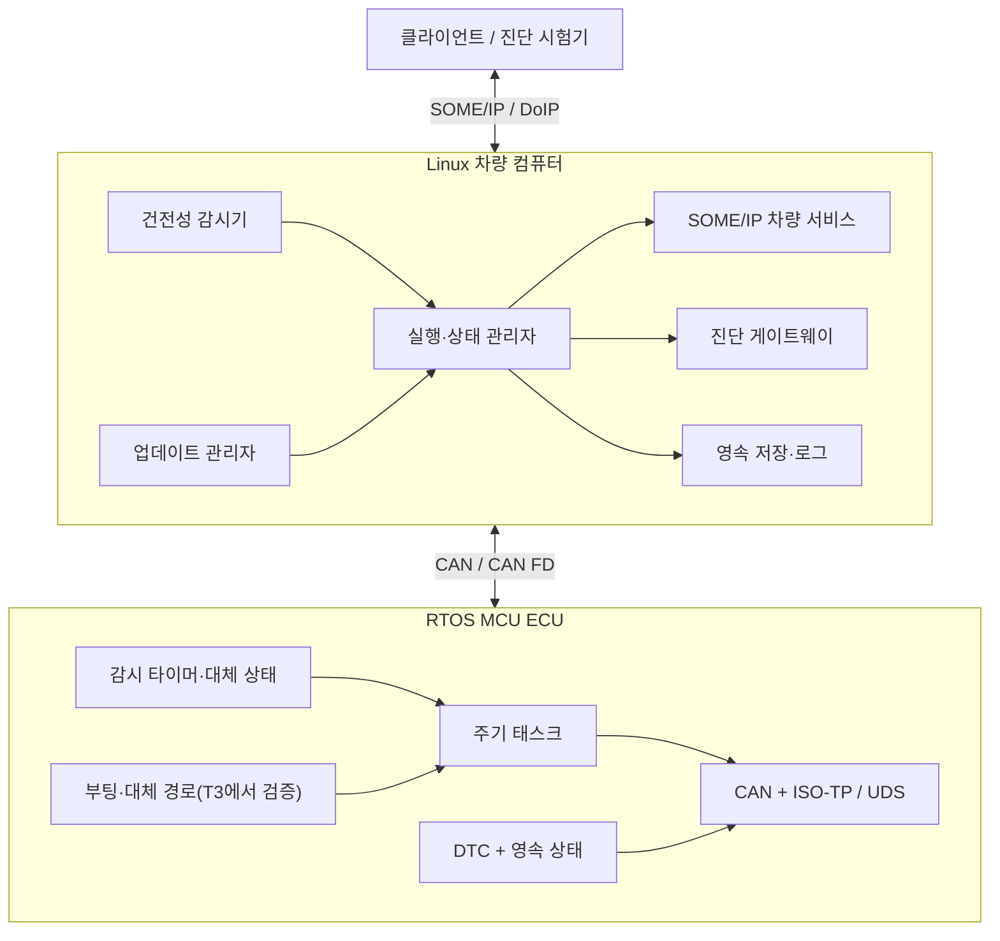

# 적응형 차량 플랫폼 실습

MCU ECU와 Linux 차량 컴퓨터를 직접 만들면서 C/C++, ARM, RTOS, 차량 통신, 진단, 업데이트, 고장 복구를 한 시스템으로 묶는 장기 학습 과정입니다.

현재 저장소에는 커리큘럼과 평가 체계가 들어 있습니다. 1장과 2장, 3장의 다섯 실습은 기준 구현·자동 검사를 바로 실행할 수 있습니다. 3장의 GCC·Clang 비교는 공식 GNU 아카이브를 해시로 검증해 준비한 뒤 실행하며, 학습자가 직접 만드는 포트폴리오는 아직 시작 전입니다.

## 번호부터 읽는 법

이 저장소는 사람이 읽는 이름과 자동 추적용 코드를 함께 씁니다. **이름이 학습 내용이고, 코드는 문서와 증거를 연결하는 관리 번호**입니다.

| 표기 | 뜻 | 예시 |
| --- | --- | --- |
| 학습 단계 `G` | 큰 학습 챕터의 관리 코드 | `G1`은 “안전한 C로 데이터와 메모리 다루기” |
| 실습 `1-1` | 한 챕터 안의 개별 과제 | `실습 1-1`은 정수와 바이트 변환 |
| 자동화 코드 `G1.1` | 실습 1-1을 검사기·증거 파일에서 부르는 이름 | 화면의 `실습 1-1`과 같은 과제 |
| 프로젝트 `P` | 여러 챕터의 결과를 합치는 포트폴리오 프로젝트 | `P00`은 MCU/RTOS ECU 프로젝트 |
| 고장 시나리오 `F` | 최종 통합 시험에서 주입하는 고장 번호 | `F01`은 MCU 태스크 실행 시간 초과 |

`G1`과 `F01`은 서로 이어지는 번호가 아닙니다. `G01_LAB_ID`는 실행할 실습을 고르는 환경 변수이고, `G1.ENTRY`는 1장 진입 확인, `G1.1`은 실습 1-1을 뜻합니다. `G1.RETEST`는 1장 전체를 두 번째 공개 입력으로 다시 검사하는 코드입니다. 경로·요구사항·시험 기록에서는 기존 코드를 유지하지만, 화면에서는 항상 설명하는 이름을 먼저 표시합니다. 전체 코드 표기는 [커리큘럼 코드 안내](docs/curriculum-codes.md)에서 한 번에 확인할 수 있습니다.

처음 시작한다면 [0장: 개발 환경과 검증 기준 준비하기](gates/g00/sprint-0.1.md)를 진행한 뒤 [1장: 안전한 C로 데이터와 메모리 다루기](gates/g01/README.md)로 이동합니다.

## 목표

이 과정을 마치면 다음 작업을 독립적으로 수행할 수 있어야 합니다.

- C/C++의 수명, 메모리 표현, UB, 동시성 계약을 코드와 테스트로 다룬다.
- Cortex-M의 부팅·예외·인터럽트와 AArch64/Linux의 ABI·메모리·프로세스 모델을 분석한다.
- RTOS 태스크 집합을 모델링하고 응답 시간 분석과 실측 결과를 함께 검토한다.
- CAN/CAN FD, ISO-TP, UDS, SOME/IP, DoIP 경로를 구현하고 패킷과 상태 전이로 진단한다.
- Classic과 Adaptive Platform의 책임 경계를 공개 사양에 맞춰 설명한다.
- Linux 프로세스, 서비스, 이미지, 배포, 관측 체계를 운영한다.
- 업데이트 상태 머신과 신뢰 사슬을 설계하고 중단 지점별 복구를 시험한다.
- 요구사항, 아키텍처, 예산, 코드, 시험, 결과를 한 흐름으로 추적한다.
- 차량 코드의 LLVM IR, ARM/AArch64 기계어, 크기와 실행 시간을 비교한다.

직무 방향은 **Linux/Adaptive 플랫폼 통합**을 주축으로 삼고, **MCU/Classic 구현**을 두 번째 축으로 둡니다. LLVM·ABI·코드 생성 분석은 각 학습 단계의 핵심 함수를 대상으로 이어 갑니다. 마지막에는 하위 시스템 하나를 골라 외부 검토, 이식, 장애 대응, 3–6개월 유지 기록으로 숙련도를 확인합니다.

## 과정 구조

현재 계획치는 **2,202–2,808시간, 91개 실습**입니다. 난도가 높은 G8.6, G9.6, G10.1, G11.4를 먼저 실행해 실제 시간으로 다시 계산합니다. 주 12–15시간 기준 달력 일정은 장비 대기와 재시험을 포함해 약 **3.5–5년**으로 봅니다. 이미 가진 역량은 사전 통과 시험으로 인정받을 수 있습니다.

아래 표는 기술 범위를 학습 단계 관리 코드로 묶은 지도입니다. 실제 학습은 G0–G3에서 공통 기반을 만든 뒤 Linux/Adaptive 축을 먼저 진행합니다.

| 구간 | 학습 단계 | 핵심 결과 |
| --- | --- | --- |
| 기반 | G0–G3 | 재현 환경, 시스템 C/C++, ARM ABI, LLVM 분석 |
| MCU | G4–G7 | 보드 기동, RTOS, CAN/진단, Classic 개념 구조 |
| Linux | G8–G10 | Linux 이미지·프로세스, 서비스 인터페이스·SOME/IP·DoIP, Adaptive 실행 환경 |
| 보증·통합 | G11A–G12 | Adaptive 보안·UCM, 교차 도메인 보증, MCU–Linux 최종 통합 |

상세 순서는 [ROADMAP.md](ROADMAP.md), 단계별 실행안은 [학습 단계 실행 안내](docs/gate-playbook.md), 91개 과제 명세는 [학습 단계별 실습 안내서](gates/README.md), 시험 방식은 [ASSESSMENTS.md](ASSESSMENTS.md)에서 확인합니다.

권장 실행 순서는 `G0–G3 → G8 → G9 → G10 → G11A → G4–G7 → G11B → G12`입니다. G11B는 Adaptive 보안 결과와 MCU/Classic 결과를 함께 검토하므로 두 축을 마친 뒤 들어갑니다.

현재 완성도와 남은 차단 항목은 [2026-08-19 커리큘럼 감사](docs/curriculum-audit.md)에 공개합니다.

## 챕터 지도

표의 순서가 권장 학습 순서입니다. 관리 코드의 숫자는 문서를 연결하는 식별자일 뿐, 진행 순서를 뜻하지 않습니다.

| 순서 | 챕터 이름 | 관리 코드 | 대표 결과물 |
| ---: | --- | --- | --- |
| 1 | 개발 환경과 검증 기준 준비하기 | G0 | 고정된 도구 모음, CI, 장비·접근 조건 ADR |
| 2 | [안전한 C로 데이터와 메모리 다루기](gates/g01/README.md) | G1 | 디코더·큐·풀·파서와 입력 모음 |
| 3 | [임베디드 C++로 안전한 런타임 만들기](gates/g02/README.md) | G2 | 안전한 데이터 수명·고정 용량 이벤트 처리·종료 가능한 큐·C ABI |
| 4 | [Arm 프로그램의 함수 호출부터 기계어까지 추적하기](gates/g03/README.md) | G3 | Cortex-M/AArch64 컴파일 분석 묶음 |
| 5 | 임베디드 Linux 이미지와 프로세스 운영하기 | G8 | P01 프로세스 감독기와 재현 가능한 이미지 |
| 6 | 서비스 인터페이스와 SOME/IP 통신 구현하기 | G9 | Proxy/Skeleton, P02, P05-SIM |
| 7 | AUTOSAR Adaptive 실행·상태·진단·권한 이해하기 | G10 | P03 관리형 Linux 노드 |
| 8 | 안전한 업데이트와 UCM 구현하기 | G11A | 인증, 패키지 처리, 활성화, 롤백 |
| 9 | Cortex-M 보드 부팅과 인터럽트 구현하기 | G4 | 부팅 이미지, 타이머·인터럽트, 고장 기록 |
| 10 | RTOS 태스크와 실시간성 검증하기 | G5 | P00-A 실시간 핵심 모듈 |
| 11 | CAN 통신과 차량 진단 구현하기 | G6 | P00-B CAN·ISO-TP·UDS 확장 |
| 12 | AUTOSAR Classic 구조로 ECU 기능 묶기 | G7 | P00-C 통신·진단·DTC 스택 |
| 13 | MCU–Linux 안전·보안 근거 검토하기 | G11B | 안전·보안 논증과 하드웨어 신뢰 검증 |
| 14 | MCU–Linux 차량 플랫폼 최종 통합하기 | G12 | P06 이기종 차량 플랫폼 |

G12 이후에는 선택한 하위 시스템을 다른 대상 환경에 이식하고, 성능·신뢰성 문제를 추적하며, 설계 검토와 유지보수 기록을 쌓습니다.

## 최종 시스템



## 프로젝트 사다리

| ID | 프로젝트 | 학습 단계 | 핵심 증거 |
| --- | --- | --- | --- |
| P00 | [MCU/RTOS ECU 노드](projects/00-mcu-rtos-ecu/README.md) | G5–G7 | 응답 시간 분석, 시간 추적, CAN/UDS, DTC, 감시 타이머 |
| P01 | [프로세스 감독기](projects/01-process-supervisor/README.md) | G8 | 생명주기, pidfd·cgroup 격리, 복구 상한 |
| P02 | [차량 상태 서비스](projects/02-vehicle-state-service/README.md) | G9 | 탐색, 버전 관리, 재연결, 패킷 추적 |
| P03 | [실행 관리자](projects/03-execution-manager/README.md) | G9–G10 | DoIP 읽기 경로, 명세, 의존성, 상태, 건전성, IAM |
| P04 | [업데이트 보증 실습](projects/04-secure-update-manager/README.md) | G11 | 충돌 일관성, 진위 확인, 되돌리기 |
| P05 | [CAN–SOME/IP 수직 통합](projects/05-can-ethernet-vertical-slice/README.md) | G9/G6/G12 | G9의 vCAN 경로와 G6 이후 실제 CAN 경로 |
| P06 | [이기종 차량 플랫폼](projects/06-heterogeneous-vehicle-platform/README.md) | G12 | 두 노드의 시간·상태·버전·복구 계약 |

프로젝트는 8–16주마다 실행 가능한 판을 만듭니다. 첫 공개 후보는 G1 구성 요소 라이브러리, G2 실행 계층, G4 보드 실행 환경, G6 ISO-TP 초기판입니다. 작은 범위를 먼저 끝내고 확장 작업은 필수 근거를 확보한 뒤 넣습니다.

## 매주 하는 일

1. 설계를 바꿀 만한 질문을 하나 고른다.
2. 공식 문서와 원본 소스에서 근거를 찾는다.
3. 작은 구현과 자동 시험을 만든다.
4. 잘못된 입력, 시간 제한 초과, 과부하, 재시작 중 하나를 주입한다.
5. 원본 측정 자료와 해석을 따로 기록한다.
6. 도움 없이 설명하거나 새로운 과제로 다시 구현한다.
7. PR에 재현 명령과 남은 위험을 적는다.

주간 시간은 `현재 학습 단계 70% / 누적 복습 15% / 리뷰·정리 10% / LLVM 분석 5%`를 기본으로 사용합니다. LLVM이 현재 학습 단계의 핵심이면 비중을 늘립니다.

## 시작하기

```bash
git clone https://github.com/ThePo1es/adaptive-vehicle-platform-lab.git
cd adaptive-vehicle-platform-lab

bash scripts/check_repo.sh
git switch -c study/g00-baseline
```

첫 주에는 [기준 역량 기록](docs/baseline.md)을 작성하고, [개발 환경](docs/development-environment.md)에서 보드·RTOS·도구 모음의 기본 조합을 정합니다. 기존 경험으로 학습 단계를 건너뛰려면 [사전 통과 절차](ASSESSMENTS.md#challenge-out)를 사용합니다.

## 핵심 문서

- [역량 지도](docs/competency-map.md)
- [학습 단계 실행 안내](docs/gate-playbook.md)
- [평가와 외부 검토 절차](ASSESSMENTS.md)
- [안전·보안 공학](docs/safety-security-engineering.md)
- [개발 환경과 장비](docs/development-environment.md)
- [Linux 생명주기 소유권](docs/lifecycle-ownership.md)
- [AUTOSAR 개념 매핑](docs/autosar-mapping.md)
- [요구사항](docs/requirements.md)과 [추적성](docs/traceability.md)
- [공식 참고 자료](docs/references.md)
- [현재 진행 상태](PROGRESS.md)

## 주장 범위와 안전

이 저장소의 Classic/Adaptive 구현은 공개 사양을 공부하기 위한 개념 시제품입니다. API·ARXML 호환이나 규격 적합성을 주장하지 않습니다. 안전·보안 산출물도 교육용이며 인증 근거로 사용할 수 없습니다. 측정된 최악 시간은 분석으로 검증된 WCET 상한과 구분합니다.

실차 시험은 정차·수신 전용으로 시작합니다. 진단 쓰기, actuator 제어, 다운로드는 소유하거나 명시적으로 허가받은 벤치 장비에서만 수행합니다. VIN, 키, 인증서, 위치 정보, OEM 비공개 펌웨어·DBC·ARXML은 저장소에 올리지 않습니다. 세부 운영 규칙은 [SECURITY.md](SECURITY.md)에 있습니다.
