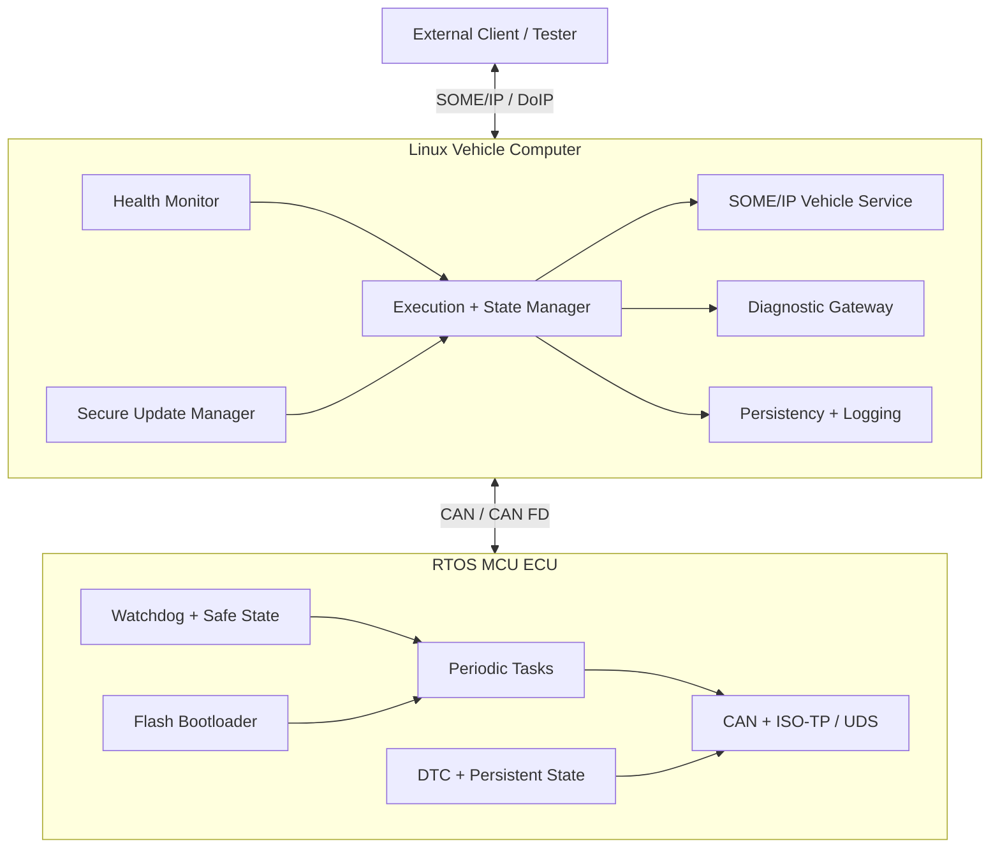
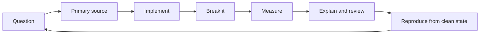

# Adaptive Vehicle Platform Lab

MCU 기반 실시간 ECU부터 Linux 기반 차량 컴퓨팅 플랫폼까지 직접 구현하며, 컴파일러·OS·차량 네트워크·진단·업데이트·고장 복구를 하나의 시스템으로 연결하는 장기 학습 저장소입니다.

> 목표 포지션: **컴파일러부터 MCU·OS·미들웨어·차량 네트워크까지 이해하는 차량 플랫폼 개발자**

> 이 저장소는 AUTOSAR Classic/Adaptive 적합 구현이 아닙니다. 공개 사양의 구조와 책임을 C/C++, Zephyr/FreeRTOS, Linux, SocketCAN, SOME/IP 등의 공개 기술로 실험하는 **concept-aligned prototype**입니다.

## 최종적으로 증명할 역량

- C의 object representation, UB, alignment, MMIO, linker/startup을 설명하고 검증한다.
- C++ 객체 수명·소유권·동시성을 제한된 임베디드 환경에 맞게 설계한다.
- Cortex-M의 exception/interrupt/MPU와 AArch64의 MMU/cache/ABI를 코드 생성까지 연결한다.
- RTOS task, ISR, 우선순위, jitter, WCET 근사치, stack 사용량을 수치로 관리한다.
- Classic AUTOSAR의 통신·진단·고장 저장 흐름을 미니 ECU stack으로 구현한다.
- Linux/QNX 스타일 process lifecycle, IPC, scheduling, logging, tracing을 플랫폼 수준으로 다룬다.
- CAN/CAN FD/ISO-TP/UDS와 Ethernet/SOME-IP/DoIP를 게이트웨이 설계로 연결한다.
- Adaptive의 EM·SM·PHM·Persistency·Diagnostics·UCM 개념을 실제 장애 복구와 매핑한다.
- LLVM IR부터 ARM/AArch64 assembly, 코드 크기, cycle/latency, UB까지 비교한다.
- 요구사항, timing/memory/CPU budget, architecture, code, test, evidence를 추적한다.

## 기간이 아니라 마스터리 게이트

Gate별 학습량은 합계 92–121주이며, 재시험·통합·외부 리뷰까지 포함하면 주 12–15시간 기준 약 **24–30개월**을 보수적으로 예상합니다. 일정이 끝났다고 통과하지 않습니다. 각 단계의 closed-book 설명, blank-page 구현, fault injection, 측정, 설계 방어를 모두 통과해야 다음 단계로 이동합니다.

G11은 끝이 아니라 core mastery입니다. 선택한 subsystem에서 Level 5(teach/review)를 증명하는 첫 전문가 사이클은 추가 **12–18개월**을 예상합니다. 즉 첫 전체 순환은 대략 3–4년이며, 이후에도 유지보수·이식·연구·교육을 반복합니다.

| Gate | Focus | 대표 결과물 |
| --- | --- | --- |
| G0 | Baseline and engineering workflow | 재현 가능한 개발·측정 환경 |
| G1 | Systems C | CAN decoder, ring buffer, memory/UB lab |
| G2 | Embedded C++ | ownership-safe event/runtime library |
| G3 | ARM and LLVM | Cortex-M/AArch64 compiler analysis suite |
| G4 | Bare-metal MCU | startup, interrupt, fault, peripheral runtime |
| G5 | RTOS ECU | measured periodic ECU simulator |
| G6 | Classic AUTOSAR concepts | communication/diagnostic/DTC mini stack |
| G7 | Linux/QNX platform | Process Supervisor and observability |
| G8 | Vehicle networks | CAN–SOME/IP and DoIP–UDS gateway |
| G9 | Adaptive platform | execution/state/health/persistency/update services |
| G10 | Security and resilience | signed update, rollback, policy, fault campaign |
| G11 | System architecture | Mixed-Criticality Vehicle Compute Platform |

G11 이후에는 E1 Maintainer → E2 Portability → E3 Performance/Reliability Research → E4 Architecture/Teaching 사이클로 넘어갑니다. 상세 조건은 [ROADMAP의 Expert Cycle](ROADMAP.md)을 따릅니다.

전체 순서와 통과 기준은 [ROADMAP.md](ROADMAP.md), 평가 방식은 [ASSESSMENTS.md](ASSESSMENTS.md), 현재 상태는 [PROGRESS.md](PROGRESS.md)에서 관리합니다.

## 최종 아키텍처



## 프로젝트 사다리

| ID | Project | 핵심 증거 |
| --- | --- | --- |
| P00 | [MCU/RTOS ECU Node](projects/00-mcu-rtos-ecu/README.md) | deadline, jitter, stack, watchdog, UDS/DTC, boot |
| P01 | [Process Supervisor](projects/01-process-supervisor/README.md) | lifecycle and bounded recovery |
| P02 | [Vehicle State Service](projects/02-vehicle-state-service/README.md) | discovery, event, versioning, reconnection |
| P03 | [Execution Manager](projects/03-execution-manager/README.md) | manifest, dependency, state, health |
| P04 | [Secure Update Manager](projects/04-secure-update-manager/README.md) | verification, activation, journal, rollback |
| P05 | [Secure Adaptive Gateway](projects/05-secure-adaptive-gateway/README.md) | Linux platform integration |
| P06 | [Mixed-Criticality Vehicle Platform](projects/06-mixed-criticality-platform/README.md) | MCU–Linux end-to-end architecture |

차별화 트랙은 [compiler-analysis/README.md](compiler-analysis/README.md)에서 모든 프로젝트의 차량용 함수를 GCC/Clang, LLVM IR, Cortex-M/AArch64 assembly, 코드 크기와 runtime 관점으로 분석합니다.

## 학습 루프



매주 Issue 하나를 만들고 다음을 남깁니다.

1. 답할 기술 질문과 반증 가능한 가설
2. 공식 문서·소스·테스트에서 확인한 근거
3. 직접 작성한 코드와 완전한 실행 명령
4. 정상 경로뿐 아니라 오류·자원 고갈·타이밍 실패
5. raw evidence와 해석을 분리한 측정 보고서
6. 아직 확인되지 않은 가정과 다음 실험

## 처음 시작하기

```bash
git clone https://github.com/ThePo1es/adaptive-vehicle-platform-lab.git
cd adaptive-vehicle-platform-lab

bash scripts/check_repo.sh
git switch -c study/g00-w01-baseline
# study/week-01/README.md와 docs/baseline.md부터 작성
```

첫 단계는 [G0/G1 계획](ROADMAP.md)과 [마스터리 평가 기준](ASSESSMENTS.md)을 읽고 자신의 baseline을 기록하는 것입니다.

## 핵심 문서

- [역량 지도와 시간 배분](docs/competency-map.md)
- [시작 실력 진단과 G0 재시험](docs/baseline.md)
- [저수준·MCU·RTOS·Classic 기초](docs/embedded-foundations.md)
- [문서 학습 순서](docs/learning-strategy.md)
- [시스템·SW 아키텍처 학습법](docs/architecture-engineering.md)
- [개발 환경과 도입 순서](docs/development-environment.md)
- [AUTOSAR 개념 매핑](docs/autosar-mapping.md)
- [요구사항](docs/requirements.md)
- [추적성 매트릭스](docs/traceability.md)
- [공식 참고 자료](docs/references.md)
- [GitHub 운영](GITHUB_SETUP.md)

## 안전 및 공개 범위

- 실차는 정차 상태에서 수신 전용으로 시작합니다.
- actuator, 진단 쓰기, RoutineControl, 다운로드는 소유·허가된 벤치 ECU에서만 수행합니다.
- VIN, 인증서, 키, 토큰, 위치, 개인 데이터, OEM 비공개 펌웨어·DBC·ARXML은 커밋하지 않습니다.
- AUTOSAR 사양 PDF를 재배포하지 않고 공식 링크와 자체 요약만 남깁니다.
- 보안은 exploit 수집이 아니라 secure boot/update, 접근 제어, 격리, malformed input, 복구 정책의 횡단 품질로 구현합니다.

자세한 공개 원칙은 [SECURITY.md](SECURITY.md)를 따릅니다.
