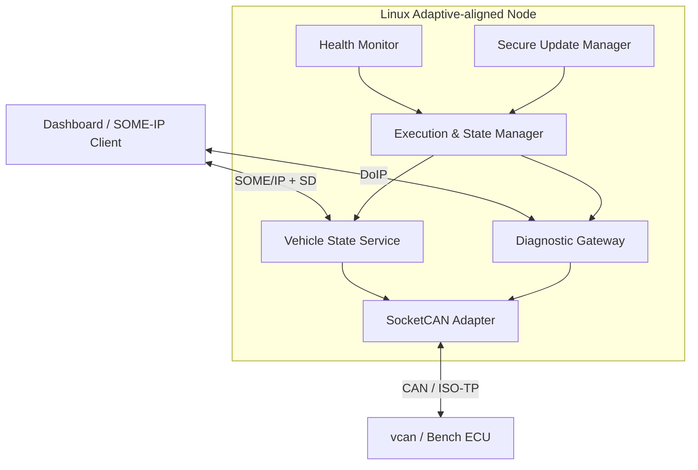

# Adaptive Vehicle Platform Lab

Linux 기반 차량 미들웨어를 직접 구현하면서 Adaptive AUTOSAR의 핵심 개념을 학습하는 개인 연구 저장소입니다.

> 이 저장소는 **AUTOSAR Adaptive Platform 적합 구현이 아닙니다.** 공개 사양의 개념을 Linux, C++20, SOME/IP, SocketCAN, UDS/DoIP 및 오픈소스 구성요소로 실험하는 **concept-aligned prototype**입니다.

## 무엇을 증명하는가

- C++20/POSIX 기반 프로세스 생명주기와 장애 복구
- SOME/IP 서비스 발견, 요청/응답, 이벤트 및 재연결
- Manifest 기반 실행·상태·헬스 관리
- CAN–SOME/IP 및 UDS/DoIP 게이트웨이
- 서명 검증, A/B 슬롯, 실패 복구를 포함한 업데이트 상태 머신
- 요구사항 → 구현 → 테스트 → 측정 결과의 추적성

## 진행 순서

| 단계 | 기간 | 학습·구현 | 대표 결과물 |
| --- | ---: | --- | --- |
| 1. 기반 | 1–4주 | Adaptive 구조, C++20, POSIX | Process Supervisor |
| 2. 통신 | 5–7주 | TCP/UDP, multicast, SOME/IP/SD | Vehicle State Service |
| 3. 플랫폼 | 8–10주 | EM, SM, Manifest, PHM, Persistency | Execution Manager |
| 4. 차량 통합 | 11–13주 | SocketCAN, ISO-TP, UDS, DoIP | Diagnostic Gateway |
| 5. 보안 업데이트 | 14–16주 | 서명, A/B 슬롯, journal, rollback | Secure Update Manager |
| 6. 통합 포트폴리오 | 17–20주 | 장애 주입, 성능, 위협 모델, 데모 | Secure Adaptive Vehicle Service Gateway |

상세 계획은 [ROADMAP.md](ROADMAP.md), 현재 진행률은 [PROGRESS.md](PROGRESS.md)에서 관리합니다.

## 목표 아키텍처



## 저장소 사용 방식


1. 이번 주 목표를 `Study task` 이슈로 만든다.
2. `study/wNN-*` 또는 `project/pNN-*` 브랜치에서 작업한다.
3. 공부한 내용은 `study/week-NN/`, 코드는 `projects/`에 기록한다.
4. 패킷, 테스트 로그, 벤치마크처럼 주장을 검증할 증거를 함께 남긴다.
5. PR 템플릿으로 스스로 검토한 뒤 `main`에 병합한다.

## 처음 시작하기

```bash
git clone https://github.com/ThePo1es/adaptive-vehicle-platform-lab.git
cd adaptive-vehicle-platform-lab

./scripts/new-study-log.sh 2 "POSIX process lifecycle"
git switch -c study/w02-posix-process-lifecycle
```

첫 주에는 [study/week-01/README.md](study/week-01/README.md)의 체크리스트부터 수행합니다. 새로운 기록을 만드는 명령과 GitHub 최초 업로드 방법은 [GITHUB_SETUP.md](GITHUB_SETUP.md)에 있습니다.

## 기록 원칙

각 학습 기록은 최소한 다음을 포함합니다.

- 내가 답하려던 질문
- 공식 자료 또는 코드에서 확인한 근거
- 직접 실행한 명령과 환경
- 성공 결과뿐 아니라 실패와 원인
- 재현 가능한 테스트 또는 캡처
- 아직 확인하지 못한 부분과 다음 행동

프로젝트 완료 기준은 “코드가 실행됨”이 아닙니다. 요구사항, 자동 테스트, 장애 시나리오, 측정 결과, 한계까지 연결되어야 합니다.

## 프로젝트

| 프로젝트 | 핵심 질문 | 상태 |
| --- | --- | --- |
| [Process Supervisor](projects/01-process-supervisor/README.md) | 프로세스를 예측 가능하게 시작·종료·복구할 수 있는가? | Planned |
| [Vehicle State Service](projects/02-vehicle-state-service/README.md) | 서비스 발견과 재연결을 증명할 수 있는가? | Planned |
| [Execution Manager](projects/03-execution-manager/README.md) | Manifest, 상태, 의존성, 헬스 정책을 연결할 수 있는가? | Planned |
| [Secure Update Manager](projects/04-secure-update-manager/README.md) | 변조·구버전·부팅 실패·전원 차단에서 안전하게 복구하는가? | Planned |
| [Secure Adaptive Gateway](projects/05-secure-adaptive-gateway/README.md) | CAN, 진단, 수명주기, 보안 업데이트를 하나의 플랫폼으로 통합했는가? | Planned |

## 문서

- [AUTOSAR 개념 매핑](docs/autosar-mapping.md)
- [문서 학습 순서](docs/learning-strategy.md)
- [개발 환경과 도입 순서](docs/development-environment.md)
- [요구사항](docs/requirements.md)
- [추적성 매트릭스](docs/traceability.md)
- [아키텍처 결정 기록](docs/architecture/README.md)
- [공식 참고 자료](docs/references.md)
- [기록 템플릿](docs/templates/README.md)

## 안전 및 공개 범위

- 실차는 정차 상태에서 수신 전용으로 시작합니다.
- 진단 쓰기, RoutineControl, 다운로드 및 제어 실험은 소유·허가된 벤치 ECU에서만 수행합니다.
- 실제 차량의 VIN, 인증서, 키, 토큰, 위치, 개인 데이터와 비공개 펌웨어는 커밋하지 않습니다.
- AUTOSAR 사양 PDF를 저장소에 재배포하지 않고 공식 링크와 자체 요약만 남깁니다.

자세한 공개 원칙은 [SECURITY.md](SECURITY.md)를 따릅니다.
