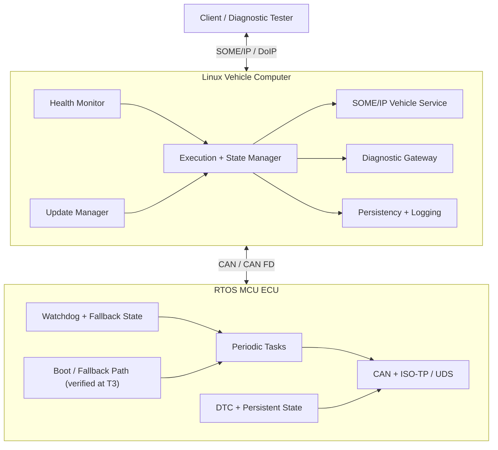

# Adaptive Vehicle Platform Lab

MCU ECU와 Linux 차량 컴퓨터를 직접 만들면서 C/C++, ARM, RTOS, 차량 통신, 진단, 업데이트, 고장 복구를 한 시스템으로 묶는 장기 학습 과정입니다.

현재 저장소에는 커리큘럼과 평가 체계가 들어 있습니다. 구현 프로젝트는 모두 `Planned` 상태이며, 코드와 측정 결과는 Gate를 진행하면서 채웁니다.

## 목표

이 과정을 마치면 다음 작업을 독립적으로 수행할 수 있어야 합니다.

- C/C++의 수명, 메모리 표현, UB, 동시성 계약을 코드와 테스트로 다룬다.
- Cortex-M의 부팅·예외·인터럽트와 AArch64/Linux의 ABI·메모리·프로세스 모델을 분석한다.
- RTOS task set을 모델링하고 response-time analysis와 실측 결과를 함께 검토한다.
- CAN/CAN FD, ISO-TP, UDS, SOME/IP, DoIP 경로를 구현하고 패킷과 상태 전이로 진단한다.
- Classic과 Adaptive Platform의 책임 경계를 공개 사양에 맞춰 설명한다.
- Linux 프로세스, 서비스, 이미지, 배포, 관측 체계를 운영한다.
- 업데이트 상태 머신과 신뢰 사슬을 설계하고 중단 지점별 복구를 시험한다.
- 요구사항, 아키텍처, 예산, 코드, 시험, 결과를 한 흐름으로 추적한다.
- 차량 코드의 LLVM IR, ARM/AArch64 기계어, 크기와 실행 시간을 비교한다.

직무 방향은 **Linux/Adaptive 플랫폼 통합**을 주축으로 삼고, **MCU/Classic 구현**을 두 번째 축으로 둡니다. LLVM·ABI·코드 생성 분석은 각 Gate의 핵심 함수를 대상으로 이어 갑니다. 마지막에는 하위 시스템 하나를 골라 외부 리뷰, 이식, 장애 대응, 3–6개월 유지 기록으로 숙련도를 확인합니다.

## 과정 구조

현재 계획치는 **2,198–2,792시간, 91개 Sprint**입니다. 난도가 높은 G8.6, G9.6, G10.1, G11.4를 먼저 실행해 실제 시간으로 다시 계산합니다. 주 12–15시간 기준 달력 일정은 장비 대기와 재시험을 포함해 약 **3.5–5년**으로 봅니다. 이미 가진 역량은 사전 통과 시험으로 인정받을 수 있습니다.

| 구간 | Gate | 핵심 결과 |
| --- | --- | --- |
| 기반 | G0–G3 | 재현 환경, Systems C/C++, ARM ABI, LLVM 분석 |
| MCU | G4–G7 | 보드 bring-up, RTOS, CAN/진단, Classic 개념 stack |
| Linux | G8–G10 | Linux 이미지·프로세스, Service Interface·SOME/IP·DoIP, Adaptive runtime |
| 보증·통합 | G11A–G12 | Adaptive 보안·UCM, 교차 도메인 보증, MCU–Linux 최종 통합 |

상세 순서는 [ROADMAP.md](ROADMAP.md), Gate별 실행안은 [Gate Playbook](docs/gate-playbook.md), 91개 과제 명세는 [Gate Lab Packs](gates/README.md), 시험 방식은 [ASSESSMENTS.md](ASSESSMENTS.md)에서 확인합니다.

현재 완성도와 남은 차단 항목은 [2026-08-19 커리큘럼 감사](docs/curriculum-audit.md)에 공개합니다.

## Gate 지도

| Gate | Focus | 대표 결과물 |
| --- | --- | --- |
| G0 | Engineering baseline | 고정된 toolchain, CI, hardware/access ADR |
| G1 | Systems C | parser·queue·pool library와 fuzz corpus |
| G2 | Embedded C++ | ownership-safe runtime layer |
| G3 | ARM ABI and LLVM | Cortex-M/AArch64 compiler analysis suite |
| G4 | Bare-metal Cortex-M | bootable image, timer/interrupt, crash record |
| G5 | RTOS and real-time analysis | P00-A 실시간 핵심 모듈 |
| G6 | CAN and diagnostics | P00-B CAN/ISO-TP/UDS extension |
| G7 | Classic Platform concepts | P00-C communication·diagnostic·DTC stack |
| G8 | Embedded Linux platform and image | P01 Process Supervisor와 재현 가능한 이미지 |
| G9 | Service-oriented vehicle communication | Service Interface, Proxy/Skeleton, P02, P05-SIM |
| G10 | Adaptive Platform functional clusters | P03, Diagnostics, IAM 정책을 포함한 managed Linux node |
| G11A | Adaptive security and UCM | 인증·package 처리·activation·rollback |
| G11B | Cross-domain assurance | safety/security argument와 hardware trust 검증 |
| G12 | System architecture and integration | P06 Heterogeneous MCU–Linux Vehicle Platform |

G12 이후에는 선택한 하위 시스템을 다른 target에 이식하고, 성능·신뢰성 문제를 추적하며, 설계 리뷰와 유지보수 기록을 쌓습니다.

## 최종 시스템



## 프로젝트 사다리

| ID | Project | Gate | 핵심 증거 |
| --- | --- | --- | --- |
| P00 | [MCU/RTOS ECU Node](projects/00-mcu-rtos-ecu/README.md) | G5–G7 | RTA, timing trace, CAN/UDS, DTC, watchdog |
| P01 | [Process Supervisor](projects/01-process-supervisor/README.md) | G8 | 생명주기, pidfd·cgroup 격리, 복구 상한 |
| P02 | [Vehicle State Service](projects/02-vehicle-state-service/README.md) | G9 | discovery, versioning, reconnection, packet trace |
| P03 | [Execution Manager](projects/03-execution-manager/README.md) | G9–G10 | DoIP read path, manifest, dependency, state, health, IAM |
| P04 | [Update Assurance Lab](projects/04-secure-update-manager/README.md) | G11 | crash consistency, authenticity, rollback |
| P05 | [CAN–SOME/IP Vertical Slice](projects/05-can-ethernet-vertical-slice/README.md) | G9/G6/G12 | G9의 vCAN 경로와 G6 이후 실제 CAN 경로 |
| P06 | [Heterogeneous Vehicle Platform](projects/06-heterogeneous-vehicle-platform/README.md) | G12 | 두 노드의 timing·state·version·recovery 계약 |

프로젝트는 8–16주마다 실행 가능한 릴리스를 만듭니다. 첫 공개 후보는 G1 component library, G2 runtime layer, G4 board runtime, G6 ISO-TP alpha입니다. 작은 범위를 먼저 끝내고 확장 작업은 필수 근거를 확보한 뒤 넣습니다.

## 매주 하는 일

1. 설계를 바꿀 만한 질문을 하나 고른다.
2. 공식 문서와 upstream source에서 근거를 찾는다.
3. 작은 구현과 자동 시험을 만든다.
4. malformed input, timeout, overload, restart 중 하나를 주입한다.
5. 원본 측정 자료와 해석을 따로 기록한다.
6. 도움 없이 설명하거나 새로운 과제로 다시 구현한다.
7. PR에 재현 명령과 남은 위험을 적는다.

주간 시간은 `현재 Gate 70% / 누적 복습 15% / 리뷰·정리 10% / LLVM 분석 5%`를 기본으로 사용합니다. LLVM이 현재 Gate의 핵심이면 비중을 늘립니다.

## 시작하기

```bash
git clone https://github.com/ThePo1es/adaptive-vehicle-platform-lab.git
cd adaptive-vehicle-platform-lab

bash scripts/check_repo.sh
git switch -c study/g00-baseline
```

첫 주에는 [baseline dossier](docs/baseline.md)를 작성하고, [개발 환경](docs/development-environment.md)에서 보드·RTOS·toolchain의 기본 조합을 정합니다. 기존 경험으로 Gate를 건너뛰려면 [challenge-out 절차](ASSESSMENTS.md#challenge-out)를 사용합니다.

## 핵심 문서

- [역량 지도](docs/competency-map.md)
- [Gate별 실행안](docs/gate-playbook.md)
- [평가와 외부 검토 절차](ASSESSMENTS.md)
- [안전·보안 공학](docs/safety-security-engineering.md)
- [개발 환경과 장비](docs/development-environment.md)
- [Linux lifecycle 소유권](docs/lifecycle-ownership.md)
- [AUTOSAR 개념 매핑](docs/autosar-mapping.md)
- [요구사항](docs/requirements.md)과 [추적성](docs/traceability.md)
- [공식 참고 자료](docs/references.md)
- [현재 진행 상태](PROGRESS.md)

## 주장 범위와 안전

이 저장소의 Classic/Adaptive 구현은 공개 사양을 공부하기 위한 개념 prototype입니다. API·ARXML 호환이나 규격 적합성을 주장하지 않습니다. 안전·보안 산출물도 교육용이며 인증 근거로 사용할 수 없습니다. 측정된 최악 시간은 분석으로 검증된 WCET 상한과 구분합니다.

실차 시험은 정차·수신 전용으로 시작합니다. 진단 쓰기, actuator 제어, 다운로드는 소유하거나 명시적으로 허가받은 벤치 장비에서만 수행합니다. VIN, 키, 인증서, 위치 정보, OEM 비공개 펌웨어·DBC·ARXML은 저장소에 올리지 않습니다. 세부 운영 규칙은 [SECURITY.md](SECURITY.md)에 있습니다.
