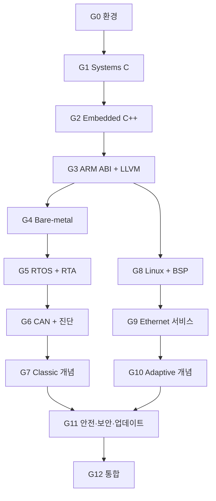

# Vehicle Platform Mastery Roadmap

진도는 시간표와 통과 증거를 함께 봅니다. 시간은 계획을 세우는 기준이고, 승급은 구현·진단·측정·전이 시험으로 결정합니다.

## 전체 규모

| Gate | 집중시간 | 예상 2주 Sprint | 결과물 |
| --- | ---: | ---: | --- |
| G0 Engineering baseline | 48–60h | 2 | toolchain·CI·장비 ADR |
| G1 Systems C | 120–150h | 5 | low-level component library |
| G2 Embedded C++ | 96–120h | 4 | ownership-safe runtime |
| G3 ARM ABI and LLVM | 120–150h | 5 | compiler analysis suite |
| G4 Bare-metal Cortex-M | 144–180h | 6 | bootable MCU runtime |
| G5 RTOS and real-time analysis | 168–210h | 7 | P00-A timing core |
| G6 CAN and diagnostics | 192–240h | 8 | P00-B network extension |
| G7 Classic Platform concepts | 144–180h | 6 | P00-C ECU stack |
| G8 Linux platform and BSP | 168–210h | 7 | P01 + Linux image |
| G9 Ethernet vehicle services | 192–240h | 8 | P02 + P05 vertical slice |
| G10 Adaptive Platform concepts | 192–240h | 8 | P03 managed Linux node |
| G11 Safety, security and update | 168–210h | 7 | P04 + assurance case |
| G12 Architecture and integration | 288–360h | 12 | P06 final platform |
| **본 과정 합계** | **2,040–2,550h** | **85** | **13 Gate** |

표의 시간은 2주 Sprint마다 24–30시간을 배정한 합계입니다. 한 Sprint 안에서 현재 Gate 70%, 누적 복습 15%, 리뷰·정리 10%, LLVM 분석 5%를 씁니다. Major Gate 시험은 마지막 Sprint의 시간에 포함하고, 분기 누적 시험은 복습 몫을 모아 진행합니다. 휴식, 장비 대기, 외부 검토, 보강 Sprint까지 포함한 달력 일정은 주 12–15시간 기준 약 3.5–4.5년입니다. 기존 실력은 사전 통과 시험으로 인정할 수 있습니다. G0–G2의 실제 속도로 남은 일정을 다시 계산합니다.

## 의존 관계

G4–G7과 G8–G10은 공통 기반 뒤에 갈라지는 두 갈래입니다. Linux/Adaptive 플랫폼 통합을 목표로 한다면 `G8 → G9 → G10 → G4 → G5 → G6 → G7` 순서를 권합니다. MCU/Classic 기반을 먼저 다지고 싶다면 반대 순서로 진행해도 됩니다. 어느 쪽을 택해도 G11에 들어가기 전 두 갈래를 모두 통과해야 합니다.

## 운영 규칙

- 동시에 진행하는 주 Gate는 하나입니다.
- 각 Sprint의 70%를 현재 Gate, 15%를 누적 복습, 10%를 리뷰·정리, 5%를 LLVM 분석에 사용합니다.
- 8–16주마다 실행 가능한 release를 냅니다.
- 각 실험에는 환경, compiler, flags, commit, workload, clock source를 기록합니다.
- simulator와 실제 장비 결과를 따로 보관합니다.
- 프로젝트 요구와 인수 예산은 구현 전에 정합니다. 실측이 기준을 넘으면 구현·모델·요구를 검토하고 ADR로 변경을 승인합니다.
- Gate에서 늦어지면 확장 항목을 먼저 뺍니다. 필수 통과 결과물은 유지합니다.
- 외부 검토를 받지 못한 Gate는 `Provisional`로 기록합니다.

각 Sprint의 과제와 범위 조정 순서는 [Gate Playbook](docs/gate-playbook.md)에 있습니다. G0–G3은 바로 시작할 수 있는 [Lab Pack](gates/README.md)이 준비되어 있습니다.

### 첫 공개 릴리스

| 시점 | 릴리스 | 공개할 내용 |
| --- | --- | --- |
| G1 종료 | C component library | decoder, bounded storage, parser, corpus, 재현 명령 |
| G2 종료 | C++ runtime layer | lifetime contract, fixed-capacity runtime, race test |
| G4 종료 | board runtime | startup, timer, fault record, watchdog, board log |
| G6 종료 | ISO-TP alpha | CAN timing, ISO-TP/UDS read path, 상호 운용 trace |
| G12.5 | walking skeleton | 두 node의 시작과 최소 data path |
| G12.9 | integration candidate | data·diagnostic·lifecycle·update 계약 |

---

## G0 — Engineering Baseline

### 선수 조건

없음. 기존 프로젝트와 경력 자료를 함께 가져옵니다.

### 배울 내용

- Git branch와 PR, 작고 되돌릴 수 있는 commit
- CMake/Ninja, GCC/Clang, Debug/Release/Sanitizer profile
- unit/integration/fault test 구분
- 재현 가능한 개발 환경과 원본 자료 관리
- 라이선스·표준 문서·장비 접근 조건 기록

### 결과물

- [baseline dossier](docs/baseline.md)와 이전 경험 근거 목록
- 한 명령으로 build/test가 끝나는 작은 C/C++ skeleton
- 고정된 compiler·RTOS·board·CAN bench 선택을 담은 ADR
- `docs-integrity` CI와 첫 PR review

### Exit

- 새 Ubuntu 환경에서 README만으로 build/test를 재현한다.
- GCC와 Clang build가 경고 없이 끝난다.
- ASan 또는 UBSan으로 결함 하나를 찾아 수정한다.
- 소프트웨어 라이선스와 공개 가능한 자료의 범위를 기록한다.

---

## G1 — Systems C

### 배울 내용

- integer conversion, overflow, object representation, alignment, endianness
- lifetime, effective type, aliasing, pointer bounds
- `volatile`, atomic, compiler barrier, hardware barrier
- fixed-size pool, bounded queue, state machine, error propagation
- parser hardening, fuzzing, property test, mutation score

### 결과물

- endian-safe signal decoder
- bounded queue와 fixed-size pool
- length-aware binary parser
- MMIO/ISR boundary를 흉내 낸 driver shell
- libFuzzer/AFL++ 또는 동등한 fuzz harness와 malformed corpus

### Exit

- packet pool 또는 DMA descriptor queue를 90분 안에 새로 구현한다.
- 숨겨진 parser corpus에서 crash와 state corruption이 없다.
- sanitizer, coverage, mutation 결과로 test strength를 설명한다.
- API마다 bounds, ownership, concurrency, failure contract가 있다.

---

## G2 — Embedded C++

### 배울 내용

- object lifetime, RAII, move/copy, non-owning view
- fixed-capacity container와 allocator policy
- `span`, `optional`, `variant`, expected-style error
- exception·RTTI·heap 정책과 code-size 영향
- mutex, condition variable, atomic ordering, zero-copy lifetime

### 결과물

- ownership-safe message buffer
- fixed-capacity event runtime
- file descriptor·socket·process handle RAII wrapper
- 대체 가능한 clock, transport, launcher interface

### Exit

- 처음 보는 message pipeline의 dangling view와 race를 진단한다.
- C와 C++ 구현을 lifetime risk, code size, testability로 비교한다.
- heap 허용·제한 두 설계의 failure behavior를 설명한다.

---

## G3 — ARM ABI and LLVM

G3는 ISA·ABI·binary·compiler 분석에 집중합니다. Cortex-M fault handler와 peripheral bring-up은 G4에서 다룹니다.

### 배울 내용

- AAPCS32/AAPCS64, ELF, section, symbol, relocation, linker map
- Cortex-M과 AArch64의 register·calling convention 차이
- Clang AST, LLVM IR, optimization, instruction selection
- cache·TLB·DMA coherency·memory ordering의 기본 모델
- compiler/version/target별 지원 flag와 LTO 구성

### 결과물

- CAN decode, CRC, queue, parser, state machine 분석 corpus
- Clang LLVM IR과 GCC GIMPLE/RTL dump, 두 compiler의 assembly·size 재생성 script
- 동일 target 안에서 수행한 성능 비교 보고서
- upstream issue의 최소 reproducer 또는 test-first 분석

### Exit

- AAPCS32와 AAPCS64의 인자·구조체·return 전달을 assembly에서 찾는다.
- linker map의 주요 section과 symbol을 source까지 역추적한다.
- source, IR, machine code, runtime 결과를 한 보고서로 연결한다.
- upstream merge 여부와 함께 재현 품질, test, 검토 의견을 평가받는다.

---

## G4 — Bare-metal Cortex-M

### 기본 target

G0 ADR에서 Cortex-M4/M7 또는 M33 계열 하나를 고릅니다. 다른 core의 fault, cache, MPU, TrustZone 차이는 capability matrix에 기록합니다.

### 배울 내용

- reset, vector table, startup, linker script, `.data/.bss`
- interrupt priority, exception frame, fault status
- clock tree, monotonic timer, UART, GPIO, DMA 또는 CAN driver shell
- watchdog, reset reason, crash record, flash layout
- reference manual, schematic, errata를 읽는 방법

### 결과물

- 보드에서 부팅되는 최소 image
- timer interrupt와 UART 진단 경로
- fault register·stacked context를 보존하는 crash record
- watchdog reset reason과 dual-image layout 설계

### Exit

- 빈 프로젝트에서 reset부터 `main`까지 구성한다.
- interrupt storm, queue full, peripheral timeout을 주입한다.
- logic analyzer 또는 cycle counter로 timer/ISR 동작을 측정한다.
- simulator 결과와 보드 결과의 차이를 기록한다.

---

## G5 — RTOS and Real-Time Analysis

### 배울 내용

- periodic·sporadic task model, release jitter, blocking, interference
- rate/deadline monotonic, fixed-priority response-time analysis, EDF 개요
- priority inversion, inheritance, ceiling protocol
- ISR deferred work, queue, event, timer, watchdog
- stack·heap·CPU budget, overload semantics, 측정 오차

### 결과물: P00-A

- 요구사항에서 도출한 periodic task set과 deadline
- response-time analysis sheet 또는 script
- synthetic queue, watchdog, fallback state가 포함된 RTOS 핵심 모듈
- timing·stack·queue 원본 자료와 분석 보고서

### Exit

- 분석한 response-time bound와 실측 분포를 비교한다.
- priority inversion과 overload를 숨은 fault로 진단한다.
- 장기 soak, interrupt interference, clock 조건을 나눠 시험한다.
- `worst observed`와 WCET 상한을 문서에서 구분한다.

---

## G6 — CAN, ISO-TP and UDS

### 배울 내용

- CAN/CAN FD arbitration, bit timing, load, error confinement, bus-off
- 고정 우선순위 CAN response-time analysis
- DBC-style serialization과 freshness policy
- ISO-TP addressing, flow control, BS, STmin, sequence, timer matrix
- UDS session, P2/P2*, S3, NRC, read service, DTC 기본 흐름

### 결과물: P00-B

- bounded CAN TX/RX queue와 signal encode/decode
- ISO-TP state machine과 read-focused UDS endpoint
- vcan 시험과 두 physical CAN node의 packet 자료
- termination·bit-rate mismatch·bus-off fault report

### Exit

- CAN load와 message response time을 계산하고 실측과 비교한다.
- ISO-TP timeout·sequence 오류·flood corpus를 통과한다.
- 실제 transceiver bench에서 bus-off와 복구 정책을 관찰한다.
- 안전한 read service만 허용한 interoperability test를 수행한다.

---

## G7 — Classic Platform Concept Fluency

### 배울 내용

- OS/RTE와 SWC runnable 책임
- CanIf, PduR, COM, CanTp, DCM, DEM, NvM
- EcuM, BswM, WdgM, ComM, CanSM, CanNm의 상태 책임
- E2E, SecOC, CSM/CryptoIf의 적용 지점
- ARXML/configuration/generated artifact의 역할

### 결과물: P00-C

- CAN → CanIf-like → PduR-like → COM-like → application 경로
- ISO-TP → DCM-like → application → response 경로
- fault → DEM-like → NvM-like → reboot restore 경로
- 작은 schema에서 static configuration code를 생성하는 실습
- 공식 release와 local behavior를 비교한 mapping table

### Exit

- 세 vertical slice를 packet과 call trace로 재현한다.
- timeout, NRC, storage corruption, startup mode fault를 자동 시험한다.
- AUTOSAR OS와 선택 RTOS의 차이를 설명한다.
- 결과물 표기는 `Classic concept-aligned prototype`으로 유지한다.

첫 포트폴리오 출구는 여기입니다. P00 v1 release와 외부 리뷰를 마치면 MCU/BSW 지원용 증거 묶음이 생깁니다.

---

## G8 — Linux Platform and BSP

### 배울 내용

- process group, signal, spawn/exec, exit status, bounded shutdown
- thread scheduling, affinity, backpressure, shared memory, `epoll`
- systemd, cgroup, capability, seccomp, core dump, `strace`, `perf`
- cross sysroot, boot chain, kernel config, Device Tree
- Buildroot 또는 Yocto image, package, SBOM, 재현 가능한 배포

### 결과물: P01

- Process Supervisor와 deterministic test double
- AArch64 board/VM용 Linux image와 service package
- process crash, hang, forked-child, resource pressure fault report
- PREEMPT_RT 또는 scheduling policy 비교 실험

### Exit

- process tree 전체를 정해진 시간 안에 종료·복구한다.
- 처음 보는 hang/crash를 core dump와 syscall trace로 진단한다.
- image를 새 환경에서 build하고 target에서 service를 부팅한다.
- privilege와 resource policy가 자동 시험으로 확인된다.

QNX는 [선택 심화](#선택-심화-gate)에서 같은 contract를 이식합니다.

---

## G9 — Ethernet Vehicle Services

### 배울 내용

- Ethernet, VLAN, multicast, TCP/UDP, socket backpressure
- SOME/IP header와 SOME/IP-SD lifecycle, TTL, eventgroup, counter
- DoIP routing activation, alive check, diagnostic routing
- service version·availability·stale-data 정책
- PTP/gPTP 개념, clock offset·drift·uncertainty 측정

### 결과물

- P02 SOME/IP Vehicle State Service
- P05 CAN–SOME/IP vertical slice
- DoIP read path의 최소 diagnostic gateway
- packet capture, latency·drop·reconnect report

### Exit

- 두 Linux node에서 discovery·subscription·reconnection을 재현한다.
- 다른 implementation 또는 tester와 상호 운용 시험을 한다.
- timestamp의 clock domain과 uncertainty를 interface contract에 적는다.
- CAN data 하나가 SOME/IP event로 이어지는 작은 release를 낸다.

---

## G10 — Adaptive Platform Concept Fluency

### 배울 내용

- Execution, State, Platform Health Management의 책임 분리
- Communication, Persistency, Log and Trace, Diagnostics의 관계
- Execution/Service Interface/Service Instance/Machine Manifest 구조
- process dependency, function group state, health supervision
- service deployment·version·persisted state 복구

### 결과물: P03

- schema-validated manifest와 dependency DAG
- state decision, process action, health observation이 분리된 manager
- P01/P02를 사용하는 managed Linux vehicle node
- 선택한 AUTOSAR release의 manifest 요소 매핑

### Exit

- dependency cycle, missed heartbeat, illegal state, corrupted state를 진단한다.
- 비공개 설계 문제에서 EM/SM/PHM 경계를 찾아 고친다.
- 공식 Adaptive SDK를 쓰지 않은 범위를 mapping 문서에 남긴다.
- 외부 reviewer가 lifecycle·state·health trade-off를 검토한다.

두 번째 포트폴리오 출구는 여기입니다. P01–P03 release는 Linux/플랫폼 직무에 맞춘 증거 묶음으로 정리합니다.

---

## G11 — Safety, Cybersecurity and Update Engineering

### 배울 내용

- item definition, HARA, safety goal, ASIL 개념, technical safety requirement
- FMEA/FTA, safety mechanism, freedom from interference, assurance case
- asset·threat scenario·impact·attack path를 다루는 TARA
- trust root, verified boot, key lifecycle, anti-rollback
- transaction journal, canonical manifest, A/B activation, health check, rollback
- ISO 26262, ISO/SAE 21434, software update engineering과 R156의 역할

### 결과물: P04

- T1 crash-consistent updater
- T2 authenticated updater
- T3 rollback-protected chain은 실제 trust root와 보호된 monotonic state를 쓸 수 있을 때 진행
- boot root, key, monotonic state, caller identity의 신뢰 가정
- 교육용 HARA·FMEA·TARA와 주장–논리–근거 문서
- kill simulation과 실제 power-cut 결과를 분리한 fault matrix

### Exit

- package 경로·symlink·TOCTOU·encoding·signature negative corpus를 통과한다.
- 가능한 모든 transaction state에서 중단 후 복구한다.
- immutable trust root와 rollback counter가 없는 환경의 한계를 설명한다.
- 두 명의 reviewer가 safety/security 주장과 evidence를 따로 검토한다.

세부 과정은 [Safety and Security Engineering](docs/safety-security-engineering.md)을 따릅니다.

---

## G12 — System Architecture and Integration

### 결과물: P06 Heterogeneous MCU–Linux Vehicle Platform

- P00 MCU node와 P01–P04 Linux node
- CAN/CAN FD vehicle data path와 SOME/IP service
- DoIP–UDS read path
- lifecycle, health, persistency, logging
- Linux update와 MCU firmware compatibility/fallback policy
- task overrun, watchdog reset, bus-off, service crash, network loss, update rollback

### 필수 계약

| 계약 | 문서에 들어갈 내용 |
| --- | --- |
| Data | unit, range, quality, sequence, freshness, ownership |
| Time | end-to-end deadline, hop budget, clock domain, uncertainty |
| Queue | capacity, backpressure, drop/overwrite/block policy |
| State | startup, driving, diagnostic, update, degraded, fallback |
| Version | service·gateway·MCU compatibility와 partial deployment |
| Recovery | detection, containment, action, time bound, 근거 |
| Update | trust assumption, activation order, known-good recovery |

### Exit

- 제3자가 새 환경에서 문서만 보고 전체 demo를 재현한다.
- 10개 이상의 fault scenario가 자동 실행된다.
- RTA, timing, CPU, memory, network budget이 원본 자료와 연결된다.
- requirement → architecture → code → test → result 추적이 완성된다.
- 외부 요구 변경을 받아 영향 분석과 ADR 수정을 수행한다.
- 영어 README, versioned release, 5–10분 기술 데모를 공개한다.

세 번째 포트폴리오 출구는 전체 플랫폼 release입니다. 이 결과는 이 저장소에서 구현한 MCU–Linux 통합 역량을 보여 줍니다.

---

## Major Gate와 유지 시험

종합시험은 G0, G3, G5, G7, G10, G12의 마지막 Sprint 안에서 실시합니다. 나머지 Gate는 lab exit test와 전이 과제로 마칩니다. 분기 누적 시험은 필수 선수 기술 2개, 간격 반복 대기열 1개, 무작위 기술 1개를 표본으로 삼습니다. 핵심 선수 기술에서 실패하면 관련 후속 Gate를 잠시 멈추고 1주 보강합니다.

[ASSESSMENTS.md](ASSESSMENTS.md)에 외부 검토, 비공개 고장 과제, 재시험 규칙이 정리되어 있습니다.

## 선택 심화 Gate

### Q1 — QNX Neutrino portability

정식 SDP와 문서 접근 권한이 있을 때 진행합니다.

- `MsgSend/MsgReceive/MsgReply`, channel, connection, pulse
- thread priority와 synchronous IPC의 priority behavior
- resource manager와 namespace
- procnto, tracing, crash 분석
- P01의 lifecycle/fault contract를 QNX에 이식하고 Linux 결과와 비교

### N1 — Advanced Vehicle Ethernet

- gPTP clock error 측정
- TSN scheduling·traffic shaping 개념 실습
- switch configuration과 hardware timestamp
- SOME/IP-TP, E2E protection profile 심화

### B1 — BSP and SoC depth

- U-Boot/UEFI, kernel port, SMMU/IOMMU, GIC
- 작은 kernel module 또는 driver와 Yocto 비교
- DMA mapping, cache coherency, driver 성능
- virtualization·partitioning은 실제 격리 요구가 있을 때 추가

### M1 — Mixed-Criticality Systems

이 용어를 프로젝트에 사용하려면 별도 Gate를 통과합니다.

- assurance/criticality level과 workload model
- shared-resource interference와 temporal/spatial partitioning
- mode change와 degraded service
- schedulability·isolation·assurance 근거

## Expert Cycle

G12 뒤에는 한 subsystem을 정해 Level 5를 준비합니다. 수량보다 실제 영향, 유지 기간, 외부 반박을 반영한 품질을 봅니다.

| Cycle | 집중시간 | Mission | 핵심 증거 |
| --- | ---: | --- | --- |
| E1 Maintainer | 180–240h | upstream subsystem을 한 release cycle 유지 | triage, regression, review 반영 |
| E2 Portability | 180–260h | 새 MCU/OS/Linux target으로 이식 | 동일 contract suite, target delta |
| E3 Research | 220–320h | 성능·신뢰성 질문을 재현 가능한 연구로 해결 | raw data, validity, regression |
| E4 Architecture/Teaching | 180–240h | 타인 설계 리뷰와 요구 변경 주도 | 외부 defense, 교육 재현, ADR 재평가 |

Level 5 endorsement에는 다음이 필요합니다.

- 선택 subsystem에서 낯선 production-like incident를 독립적으로 해결한다.
- 변경 사항이 최소 한 release cycle과 3–6개월 regression 관찰을 견딘다.
- 독립 검토자 두 명 또는 upstream maintainer가 결과를 검토한다.
- 반대 의견을 반영해 설계나 주장을 수정한 기록이 있다.
- 다른 사람이 문서나 세션을 통해 핵심 실험을 재현한다.

이 endorsement는 선택한 subsystem과 검토 시점에만 적용됩니다.
