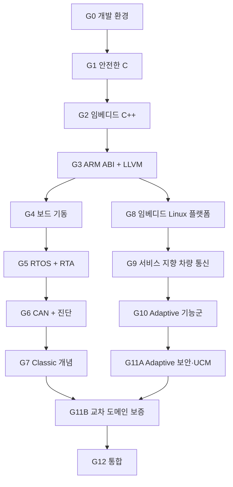

# 차량 플랫폼 숙련 로드맵

진도는 시간표와 통과 증거를 함께 봅니다. 시간은 계획을 세우는 기준이고, 승급은 구현·진단·측정·전이 시험으로 결정합니다.

## 전체 규모

| 학습 단계 | 집중 시간 | 예상 2주 실습 | 결과물 |
| --- | ---: | ---: | --- |
| G0 개발 환경과 검증 기준 준비하기 | 48–60h | 2 | 도구 모음·CI·장비 ADR |
| G1 안전한 C로 데이터와 메모리 다루기 | 124–166h | 5 | 저수준 안전 C 컴포넌트 묶음 |
| G2 임베디드 C++로 안전한 런타임 만들기 | 108–142h | 4 | 안전한 데이터 수명·고정 용량 이벤트 처리·종료 가능한 큐·C ABI |
| G3 ARM 실행 구조와 컴파일 결과 읽기 | 120–150h | 5 | 컴파일 분석 묶음 |
| G4 Cortex-M 보드 부팅과 인터럽트 구현하기 | 144–180h | 6 | 부팅 가능한 MCU 실행 기반 |
| G5 RTOS 태스크와 실시간성 검증하기 | 168–210h | 7 | P00-A 시간 분석 핵심 |
| G6 CAN 통신과 차량 진단 구현하기 | 192–240h | 8 | P00-B 네트워크 확장 |
| G7 AUTOSAR Classic 구조로 ECU 기능 묶기 | 144–180h | 6 | P00-C ECU 스택 |
| G8 임베디드 Linux 이미지와 프로세스 운영하기 | 226–294h | 9 | P01 + Linux 이미지 + 스케줄링 근거 |
| G9 서비스 인터페이스와 SOME/IP 통신 구현하기 | 242–310h | 10 | 서비스 인터페이스 + P02 + P05-SIM |
| G10 AUTOSAR Adaptive 실행·상태·진단·권한 이해하기 | 242–310h | 10 | P03 + 진단 + IAM 정책 |
| G11 안전한 업데이트와 교차 도메인 보증 | 168–228h | 7 | P04 + 보증 논증 |
| G12 MCU–Linux 차량 플랫폼 최종 통합하기 | 288–360h | 12 | P06 최종 플랫폼 |
| **본 과정 합계** | **2,202–2,808h** | **91** | **13개 학습 단계, G11은 두 단계** |

시간은 범위를 잡기 위한 계획치입니다. 실습마다 구현량이 다르므로 예상 시간도 다릅니다. 실제 작업 시간, 빌드·장시간 실행에 걸린 시간, 검토자를 기다린 시간은 서로 나눠 기록합니다. 종합 평가는 각 장의 마지막 실습 시간에 포함하고 분기 평가는 복습 시간으로 진행합니다. G8.6, G9.6, G10.1, G11.4를 실제로 돌린 뒤 전체 일정을 다시 계산합니다.

## 의존 관계

G4–G7과 G8–G10은 공통 기반 뒤에 갈라집니다. Linux/Adaptive 플랫폼 통합을 목표로 하는 기본 순서는 `G8 → G9 → G10 → G11A → G4 → G5 → G6 → G7 → G11B → G12`입니다. 이 순서에서는 인증·권한·UCM을 Adaptive 학습 직후 다룹니다. 실제 CAN 버스 오프와 MCU 시간 측정이 필요한 P05-HW는 G6 이후에 마칩니다.

## 운영 규칙

- 중심으로 진행하는 학습 단계는 한 번에 하나만 둡니다.
- 실습 시간의 70%는 현재 학습 단계, 15%는 누적 복습, 10%는 검토·정리, 5%는 LLVM 분석에 씁니다.
- 8–16주마다 다른 사람이 실행해 볼 수 있는 결과물을 공개합니다.
- 각 실험에는 실행 환경, 컴파일러, 빌드 옵션, 커밋, 작업 부하, 시간 측정 기준을 기록합니다.
- 모의 환경과 실제 장비에서 얻은 결과는 따로 보관합니다.
- 프로젝트 요구와 인수 예산은 구현 전에 정합니다. 실측이 기준을 넘으면 구현·모델·요구를 검토하고 ADR로 변경을 승인합니다.
- 일정이 늦어지면 확장 항목을 먼저 뺍니다. 필수 통과 결과물은 유지합니다.
- 외부 검토를 받지 못한 학습 단계는 `Provisional`(임시 통과)로 기록합니다.

실습의 진행 방법과 범위 조정 순서는 [학습 단계 실행 안내](docs/gate-playbook.md)에 있습니다. 91개 실습의 시간, 입력, 과제, 응용 과제, 판정 기준은 [학습 단계별 실습 안내서](gates/README.md)에 있습니다. 시작 커밋, 입력 해시, 실행 기록까지 검증된 과제만 `Runnable`(실행 가능)로 올립니다.

### 첫 공개 릴리스

| 시점 | 릴리스 | 공개할 내용 |
| --- | --- | --- |
| G1 종료 | C 구성 요소 라이브러리 | 디코더, 용량이 정해진 저장소, 파서, 입력 모음, 재현 명령 |
| G2 종료 | C++ 런타임 v1 | 수명이 보장된 데이터 뷰, 고정 용량 이벤트 처리기, 종료 가능한 큐, C17 공개 API, ELF 보고서 |
| G4 종료 | 보드 실행 기반 | 시작 코드, 타이머, 고장 기록, 감시 타이머, 보드 로그 |
| G6 종료 | ISO-TP 초기판 | CAN 시간 분석, ISO-TP/UDS 읽기 경로, 상호 운용 추적 |
| G12.5 | 최소 통합판 | 두 노드의 시작과 최소 데이터 경로 |
| G12.9 | 통합 후보판 | 데이터·진단·생명주기·업데이트 계약 |

---

## 개발 환경과 검증 기준 준비하기 (G0)

### 선수 조건

없음. 기존 프로젝트와 경력 자료를 함께 가져옵니다.

### 배울 내용

- Git 브랜치와 PR, 작고 되돌릴 수 있는 커밋
- CMake/Ninja, GCC/Clang, Debug/Release/Sanitizer 빌드 설정
- 단위·통합·고장 시험 구분
- 재현 가능한 개발 환경과 원본 자료 관리
- 라이선스·표준 문서·장비 접근 조건 기록

### 결과물

- [기준 역량 기록](docs/baseline.md)과 이전 경험 근거 목록
- 한 명령으로 빌드와 시험이 끝나는 작은 C/C++ 뼈대
- 고정된 컴파일러·RTOS·보드·CAN 시험 장비 선택을 담은 ADR
- `docs-integrity` CI와 첫 PR 검토

### 통과 기준

- 새 Ubuntu 환경에서 README만으로 빌드와 시험을 재현한다.
- GCC와 Clang 빌드가 경고 없이 끝난다.
- ASan 또는 UBSan으로 결함 하나를 찾아 수정한다.
- 소프트웨어 라이선스와 공개 가능한 자료의 범위를 기록한다.

---

## 안전한 C로 데이터와 메모리 다루기 (G1)

> 관리 코드: G1 · 권장 학습 순서: 2번째 · [챕터 시작 안내](gates/g01/README.md)

### 배울 내용

- 정수 변환과 넘침, 객체의 메모리 표현, 정렬, 바이트 순서
- 객체 수명, 유효 타입, 별칭 규칙, 포인터 범위
- `volatile`, 원자 연산, 컴파일러 장벽, 하드웨어 장벽
- 고정 크기 풀, 용량이 정해진 큐, 상태 머신, 오류 전달
- 파서 방어, 퍼징, 속성 기반 시험, 변이 검사 점수

### 결과물

- 바이트 순서에 안전한 신호 디코더
- 용량이 정해진 큐와 고정 크기 풀
- 입력 길이를 받는 바이너리 파서
- MMIO/ISR 경계를 흉내 낸 드라이버 뼈대
- libFuzzer/AFL++ 또는 같은 수준의 퍼징 실행기와 비정상 입력 모음

### 통과 기준

- 패킷 풀 또는 DMA 서술자 큐를 90분 안에 새로 구현한다.
- 비공개 파서 입력 모음에서 비정상 종료와 상태 손상이 없다.
- 메모리 검사, 실행 경로 비율, 변이 검사 결과로 시험 강도를 설명한다.
- API마다 범위, 소유권, 동시성, 실패 계약이 있다.

---

## 임베디드 C++로 안전한 런타임 만들기 (G2)

### 배울 내용

- 객체 수명, RAII, 이동·복사, 원본을 소유하지 않는 데이터 뷰
- 고정 용량 컨테이너와 메모리 할당 정책
- `span`, `optional`, `variant`, 값을 반환하는 오류 처리
- 예외·RTTI·힙 정책이 코드 크기에 미치는 영향
- 뮤텍스, 조건 변수, 원자 연산 순서, 복사 없는 데이터 수명

### 결과물

- 수명이 보장된 메시지 버퍼
- 고정 용량 이벤트 처리기
- 파일 서술자·소켓·프로세스 핸들의 RAII 래퍼
- 바꿔 끼울 수 있는 시계·전송 계층·실행기 인터페이스

### 통과 기준

- 처음 보는 메시지 처리 흐름에서 수명이 끝난 데이터 뷰와 경합을 진단한다.
- C와 C++ 구현을 수명 위험, 코드 크기, 검사 용이성으로 비교한다.
- 힙을 허용한 설계와 제한한 설계가 각각 어떻게 실패하는지 설명한다.

---

## ARM 실행 구조와 컴파일 결과 읽기 (G3)

G3는 ISA·ABI·바이너리·컴파일러 분석에 집중합니다. Cortex-M 고장 처리기와 주변 장치 초기화는 G4에서 다룹니다.

### 배울 내용

- AAPCS32/AAPCS64, ELF, 섹션, 심벌, 재배치, 링커 맵
- Cortex-M과 AArch64의 레지스터·호출 규약 차이
- Clang AST, LLVM IR, 최적화, 명령어 선택
- 캐시·TLB·DMA 일관성·메모리 순서의 기본 모델
- 컴파일러·버전·실행 대상별 빌드 옵션과 LTO 구성

### 결과물

- CAN 디코딩, CRC, 큐, 파서, 상태 머신 분석용 입력 모음
- Clang LLVM IR과 GCC GIMPLE/RTL 덤프, 두 컴파일러의 어셈블리·크기 재생성 스크립트
- 같은 실행 대상에서 수행한 성능 비교 보고서
- 상위 프로젝트 이슈의 최소 재현 예제 또는 시험 우선 분석

### 통과 기준

- AAPCS32와 AAPCS64의 인자·구조체·반환값 전달을 어셈블리에서 찾는다.
- 링커 맵의 주요 섹션과 심벌을 소스까지 역추적한다.
- 소스, IR, 기계어, 실행 결과를 한 보고서로 연결한다.
- 상위 프로젝트 반영 여부와 함께 재현 품질, 시험, 검토 의견을 평가받는다.

---

## Cortex-M 보드 부팅과 인터럽트 구현하기 (G4)

### 기본 실행 대상

[ADR-0001](docs/adr/0001-mcu-rtos-baseline.md)의 NUCLEO-G474RE/STM32G474RE Cortex-M4F를 기본 대상으로 사용합니다. 다른 코어로 옮길 때 고장 처리, 캐시, MPU, TrustZone 차이를 기능 비교표와 새 ADR에 기록합니다.

### 배울 내용

- 리셋, 벡터 테이블, 시작 코드, 링커 스크립트, `.data/.bss`
- 인터럽트 우선순위, 예외 프레임, 고장 상태
- 클록 트리, 단조 시계, UART, GPIO, DMA 또는 CAN 드라이버 뼈대
- 감시 타이머, 리셋 원인, 고장 기록, 플래시 배치
- 참조 설명서, 회로도, 정오표를 읽는 방법

### 결과물

- 보드에서 부팅되는 최소 이미지
- 타이머 인터럽트와 UART 진단 경로
- 고장 레지스터·스택 문맥을 보존하는 고장 기록
- 감시 타이머 리셋 원인과 이중 이미지 배치 설계

### 통과 기준

- 빈 프로젝트에서 리셋부터 `main`까지 구성한다.
- 인터럽트 폭주, 큐 가득 참, 주변 장치 시간 초과를 주입한다.
- 로직 분석기 또는 사이클 계수기로 타이머와 ISR 동작을 측정한다.
- 모의 환경과 보드에서 얻은 결과의 차이를 기록한다.

---

## RTOS 태스크와 실시간성 검증하기 (G5)

### 배울 내용

- 주기·비주기 태스크 모델, 시작 시각 흔들림, 막힘, 간섭
- 주기·기한 단조 우선순위, 고정 우선순위 응답 시간 분석, EDF 개요
- 우선순위 역전, 상속, 상한 프로토콜
- ISR 지연 작업, 큐, 이벤트, 타이머, 감시 타이머
- 스택·힙·CPU 예산, 과부하 때의 동작, 측정 오차

### 결과물: P00-A

- 요구사항에서 도출한 주기 태스크 집합과 기한
- 응답 시간 분석표 또는 스크립트
- 시험용 큐, 감시 타이머, 대체 상태가 포함된 RTOS 핵심 모듈
- 시간·스택·큐 원본 자료와 분석 보고서

### 통과 기준

- 분석한 응답 시간 상한과 실측 분포를 비교한다.
- 우선순위 역전과 과부하를 비공개 고장으로 진단한다.
- 장시간 실행, 인터럽트 간섭, 시계 조건을 나눠 시험한다.
- `worst observed`(관측한 최악값)와 WCET 상한을 문서에서 구분한다.

---

## CAN 통신과 차량 진단 구현하기 (G6)

### 배울 내용

- CAN/CAN FD 중재, 비트 타이밍, 부하, 오류 제한, 버스 오프
- 고정 우선순위 CAN 응답 시간 분석
- DBC 방식 직렬화와 데이터 신선도 정책
- ISO-TP 주소 지정, 흐름 제어, BS, STmin, 순서 번호, 타이머 표
- UDS 세션, P2/P2*, S3, NRC, 읽기 서비스, DTC 기본 흐름

### 결과물: P00-B

- 용량이 정해진 CAN 송수신 큐와 신호 인코딩·디코딩
- ISO-TP 상태 머신과 읽기 중심 UDS 끝점
- vcan 시험과 실제 CAN 노드 두 개에서 얻은 패킷 자료
- CAN FD DLC·BRS·ESI와 nominal/data phase를 분리한 부하·파형 자료
- 종단 저항·비트 전송률 불일치·버스 오프 고장 보고서

### 통과 기준

- CAN 부하와 메시지 응답 시간을 계산하고 실측과 비교한다.
- Classic/FD 혼재, 잘못된 DLC, 지원하지 않는 bit-rate 조합을 자동으로 거부한다.
- ISO-TP 시간 초과·순서 오류·과부하 입력 모음을 통과한다.
- 실제 트랜시버 시험 장비에서 버스 오프와 복구 정책을 관찰한다.
- 안전한 읽기 서비스만 허용한 상호 운용 시험을 수행한다.
- 오실로스코프와 차동 프로브가 없으면 소프트웨어·제어기 항목만 닫고 학습 단계 상태를 `Provisional`로 유지한다.

---

## AUTOSAR Classic 구조로 ECU 기능 묶기 (G7)

### 배울 내용

- OS/RTE와 SWC runnable 책임
- CanIf, PduR, COM, CanTp, DCM, DEM, NvM
- EcuM, BswM, WdgM, ComM, CanSM, CanNm의 상태 책임
- E2E, SecOC, CSM/CryptoIf의 적용 지점
- ARXML·설정·생성 산출물의 역할

### 결과물: P00-C

- CAN → CanIf 유사 계층 → PduR 유사 계층 → COM 유사 계층 → 애플리케이션 경로
- ISO-TP → DCM 유사 계층 → 애플리케이션 → 응답 경로
- 고장 → DEM 유사 계층 → NvM 유사 계층 → 재부팅 복원 경로
- 작은 스키마에서 정적 설정 코드를 생성하는 실습
- 공식 릴리스와 로컬 동작을 비교한 매핑표

### 통과 기준

- 세 종단 경로를 패킷과 호출 기록으로 재현한다.
- 시간 초과, NRC, 저장소 손상, 시작 모드 고장을 자동 시험한다.
- AUTOSAR OS와 선택 RTOS의 차이를 설명한다.
- 결과물은 `Classic concept-aligned prototype`(Classic 개념 대응 시제품)이라고 표시한다.

P00 v1 릴리스와 외부 검토까지 마치면 MCU/BSW 지원 직무에 제출할 근거 묶음이 생깁니다.

---

## 임베디드 Linux 이미지와 프로세스 운영하기 (G8)

### 배울 내용

- 프로세스 그룹, 시그널, 생성·실행, 종료 상태, 시간 상한이 있는 종료
- 스레드 스케줄링, CPU 고정, 역압, 공유 메모리, `epoll`
- systemd, cgroup, 권한 능력, seccomp, 코어 덤프, `strace`, `perf`
- 교차 빌드 sysroot, 부팅 사슬, 커널 설정, Device Tree
- Buildroot 이미지, 패키지, SBOM, 재현 가능한 배포

### 결과물: P01

- 프로세스 감독기와 결정적 시험 대역
- AArch64 QEMU·보드용 Linux 이미지와 서비스 패키지
- 프로세스 비정상 종료, 멈춤, 자식 프로세스 이탈, 자원 압박 고장 보고서
- 스케줄링 정책·우선순위 역전 실험과 실제 실행 대상의 PREEMPT_RT 비교

### 통과 기준

- 전용 cgroup과 pidfd를 사용해 이탈한 하위 프로세스까지 정해진 시간 안에 종료·회수한다.
- 처음 보는 멈춤과 비정상 종료를 코어 덤프와 시스템 호출 기록으로 진단한다.
- 이미지를 새 환경에서 빌드하고 실행 대상에서 서비스를 부팅한다.
- 권한과 자원 정책이 자동 시험으로 확인된다.

실제 보드 BSP 기동과 Yocto 레시피 이식, QNX 이식은 [선택 심화](#선택-심화-과정)에서 같은 계약으로 진행합니다.

---

## 서비스 인터페이스와 SOME/IP 통신 구현하기 (G9)

### 배울 내용

- Ethernet, VLAN, 멀티캐스트, TCP/UDP, 소켓 역압
- 서비스 인터페이스와 생성된 Proxy/Skeleton의 책임
- SOME/IP 헤더와 SOME/IP-SD 생명주기, TTL, 이벤트 그룹, 계수기
- DoIP 라우팅 활성화, 생존 확인, 진단 라우팅
- 서비스 버전·가용성·오래된 데이터 처리 정책
- PTP/gPTP 개념, 시계 오프셋·드리프트·불확실성 측정

### 결과물

- P02 SOME/IP 차량 상태 서비스
- P05-SIM vCAN–SOME/IP 종단 경로
- P03-D0 읽기 전용 DoIP 게이트웨이와 전송·UDS 결과 분리
- 패킷 캡처, 지연·손실·재연결 보고서

### 통과 기준

- 두 Linux 노드에서 탐색·구독·재연결을 재현한다.
- 다른 구현 또는 시험 도구와 상호 운용 시험을 한다.
- 타임스탬프의 시계 영역과 불확실성을 인터페이스 계약에 적는다.
- 로컬 IDL에서 Proxy/Skeleton을 생성하고 애플리케이션 경계를 시험한다.
- vCAN 데이터 하나가 SOME/IP 이벤트로 이어지는 작은 릴리스를 낸다.

---

## AUTOSAR Adaptive 실행·상태·진단·권한 이해하기 (G10)

### 배울 내용

- 실행 관리, 상태 관리, 플랫폼 건전성 관리의 책임 분리
- 통신, 영속성, 로그·추적, 진단, IAM·암호 기능의 관계
- 애플리케이션 설계, 실행, 서비스 인스턴스, 머신 관련 manifest와 서비스 인터페이스 산출물의 구분
- 프로세스 의존성, 기능 그룹 상태, 건전성 감독
- 서비스 배포·버전·저장 상태 복구

### 결과물: P03

- 스키마로 검증한 manifest와 의존 관계 DAG
- 상태 판단, 생명주기 판단, 프로세스 조치, 건전성 관찰을 분리한 관리자
- 읽기 전용 진단 관리자와 인증 주체 정책 엔진
- P01/P02를 사용하는 관리형 Linux 차량 노드
- 선택한 AUTOSAR 릴리스의 manifest 요소 매핑

### 통과 기준

- 순환 의존성, 놓친 heartbeat, 허용되지 않은 상태, 손상된 상태, 권한 정책 오류를 진단한다.
- 비공개 설계 문제에서 EM/SM/PHM 경계를 찾아 고친다.
- 공식 Adaptive SDK를 쓰지 않은 범위를 매핑 문서에 남긴다.
- 외부 검토자가 생명주기·상태·건전성 사이의 절충안을 검토한다.

여기까지 마치면 P01–P03을 Linux 차량 플랫폼 직무용 릴리스로 묶을 수 있습니다. 실제 `ara::*`, ARXML, 공급사 SDK 경험은 뒤의 산업용 연결 과정에서 별도 증거로 남깁니다.

---

## 안전한 업데이트와 교차 도메인 보증 (G11)

### G11A — G10 직후

- 인증된 주체와 버전이 붙은 인가 정책
- 소프트웨어 패키지·소프트웨어 클러스터·의존성·호환성 계약
- 전송 재개, 준비 영역 격리, 저장 공간 고갈
- 패키지 처리, 기능 그룹 상태 연동, 활성화, 건전성 확인, 되돌리기

### G11B — G7과 G11A 이후

- 항목 정의, HARA, 안전 목표, ASIL 개념, 기술 안전 요구사항
- FMEA/FTA, 안전 메커니즘, 간섭으로부터의 자유, 보증 논증
- 자산·위협 시나리오·영향·공격 경로를 다루는 TARA
- 신뢰 기준점, 검증된 부팅, 키 생명주기, 이전 버전 설치 방지
- 트랜잭션 일지, 정규 manifest, A/B 활성화, 건전성 확인, 되돌리기
- ISO 26262, ISO/SAE 21434, 소프트웨어 업데이트 공학과 R156의 역할

### 결과물: P04

- T1 비정상 종료에도 일관성을 지키는 업데이트 도구
- T2 인증 기능이 있는 업데이트 도구
- T3 이전 버전 설치 방지 사슬은 실제 신뢰 기준점과 보호된 단조 상태를 쓸 수 있을 때 진행
- 부팅 신뢰 기준점, 키, 단조 상태, 호출자 신원의 신뢰 가정
- 교육용 HARA·FMEA·TARA와 주장–논리–근거 문서
- 강제 종료 모의 시험과 실제 전원 차단 결과를 분리한 고장표

### 통과 기준

- 패키지 경로·심벌릭 링크·TOCTOU·인코딩·서명 오류 입력 모음을 통과한다.
- 가능한 모든 트랜잭션 상태에서 중단 후 복구한다.
- 바꿀 수 없는 신뢰 기준점과 되돌리기 방지 계수기가 없는 환경의 한계를 설명한다.
- 검토자 두 명이 안전·보안 주장과 근거를 따로 검토한다.

세부 과정은 [안전·보안 공학](docs/safety-security-engineering.md)을 따릅니다.

---

## MCU–Linux 차량 플랫폼 최종 통합하기 (G12)

### 결과물: P06 이기종 MCU–Linux 차량 플랫폼

- P00 MCU 노드와 P01–P04 Linux 노드
- CAN/CAN FD 차량 데이터 경로와 SOME/IP 서비스
- DoIP–UDS 읽기 경로
- 생명주기, 건전성, 영속성, 로깅
- Linux 업데이트와 MCU 펌웨어 호환성·대체 동작 정책
- 태스크 실행 시간 초과, 감시 타이머 리셋, 버스 오프, 서비스 비정상 종료, 네트워크 단절, 업데이트 되돌리기

### 필수 계약

| 계약 | 문서에 들어갈 내용 |
| --- | --- |
| 데이터 | 단위, 범위, 품질, 순서 번호, 신선도, 소유 주체 |
| 시간 | 종단 기한, 구간별 예산, 시계 영역, 불확실성 |
| 큐 | 용량, 역압, 삭제·덮어쓰기·대기 정책 |
| 상태 | 시작, 주행, 진단, 업데이트, 성능 저하, 대체 동작 |
| 버전 | 서비스·게이트웨이·MCU 호환성과 부분 배포 |
| 복구 | 탐지, 격리, 조치, 시간 상한, 근거 |
| 업데이트 | 신뢰 가정, 활성화 순서, 정상 상태 복구 |

### 통과 기준

- 제3자가 새 환경에서 문서만 보고 전체 시연을 재현한다.
- 10개 이상의 고장 시나리오가 자동 실행된다.
- RTA, 시간, CPU, 메모리, 네트워크 예산이 원본 자료와 연결된다.
- 요구사항 → 아키텍처 → 코드 → 시험 → 결과 추적이 완성된다.
- 외부 요구 변경을 받아 영향 분석과 ADR 수정을 수행한다.
- 영문 README, 버전이 붙은 릴리스, 5–10분 기술 시연을 공개한다.

마지막 결과물은 전체 플랫폼 릴리스입니다. MCU–Linux 경로를 직접 구현하고 고장을 추적한 기록까지 한 묶음으로 제출합니다.

---

## 종합 평가와 유지 시험

종합 평가는 G0, G3, G5, G7–G11, G12의 마지막 실습에서 진행합니다. 나머지 학습 단계는 실습별 통과 시험과 응용 과제로 마칩니다. 분기 누적 시험은 필수 선수 기술 2개, 간격 반복 대기열 1개, 무작위 기술 1개를 표본으로 삼습니다. 핵심 선수 기술에서 실패하면 관련 후속 단계를 잠시 멈추고 1주 동안 보강합니다.

[ASSESSMENTS.md](ASSESSMENTS.md)에 외부 검토, 비공개 고장 과제, 재시험 규칙이 정리되어 있습니다.

## 선택 심화 과정

### Q1 — QNX Neutrino 이식

정식 SDP와 문서 접근 권한이 있을 때 진행합니다.

- `MsgSend/MsgReceive/MsgReply`, channel, connection, pulse
- thread priority와 synchronous IPC의 priority behavior
- resource manager와 namespace
- procnto, tracing, crash 분석
- P01의 lifecycle/fault contract를 QNX에 이식하고 Linux 결과와 비교

### N1 — 차량 Ethernet 심화

- gPTP clock error 측정
- TSN scheduling·traffic shaping 개념 실습
- switch configuration과 hardware timestamp
- SOME/IP-TP, E2E protection profile 심화

### B1 — BSP와 SoC 심화

- U-Boot/UEFI, kernel port, SMMU/IOMMU, GIC
- 작은 kernel module 또는 driver와 Yocto 비교
- DMA mapping, cache coherency, driver 성능
- virtualization·partitioning은 실제 격리 요구가 있을 때 추가

### M1 — 혼합 중요도 시스템

이 용어를 프로젝트에 사용하려면 별도 심화 과정을 통과합니다.

- assurance/criticality level과 workload model
- shared-resource interference와 temporal/spatial partitioning
- mode change와 degraded service
- schedulability·isolation·assurance 근거

## G12 이후 장기 유지·이식

G12 뒤에는 하위 시스템 하나를 정해 숙련도 5단계를 준비합니다. 실제 영향, 유지 기간, 외부 반박을 반영한 기록을 봅니다.

| 단계 | 집중시간 | 할 일 | 핵심 근거 |
| --- | ---: | --- | --- |
| E1 유지보수 | 180–240h | 상위 프로젝트의 하위 시스템을 한 릴리스 주기 동안 유지 | 문제 분류, 회귀 검사, 검토 의견 반영 |
| E2 이식 | 180–260h | 새 MCU·OS·Linux 실행 대상으로 이식 | 같은 계약 검사, 실행 대상별 차이 |
| E3 연구 | 220–320h | 성능·신뢰성 질문을 재현 가능한 연구로 해결 | 원본 자료, 유효성, 회귀 검사 |
| E4 아키텍처·교육 | 180–240h | 다른 사람의 설계 검토와 요구 변경 주도 | 외부 반박, 교육 재현, ADR 재평가 |

숙련도 5단계 검토에는 다음이 필요합니다.

- 선택한 하위 시스템에서 낯선 운영 환경의 장애를 독립적으로 해결한다.
- 변경 사항이 최소 한 릴리스 주기와 3–6개월 회귀 관찰을 견딘다.
- 독립 검토자 두 명 또는 상위 프로젝트 유지보수자가 결과를 검토한다.
- 반대 의견을 반영해 설계나 주장을 수정한 기록이 있다.
- 다른 사람이 문서나 세션을 통해 핵심 실험을 재현한다.

판정 범위는 선택한 하위 시스템과 검토 시점으로 제한합니다.
