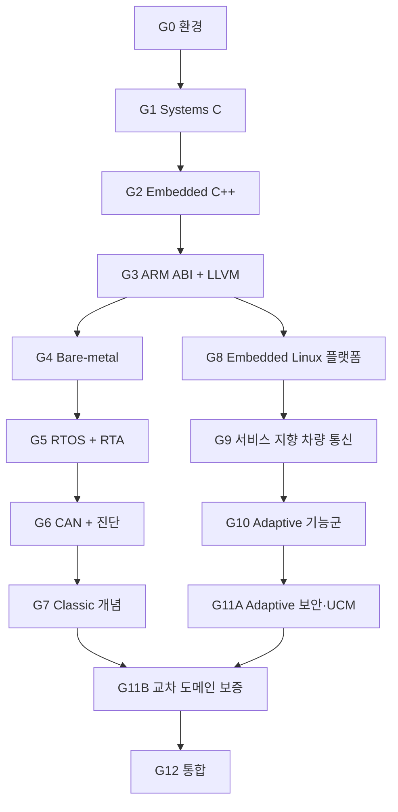

# Vehicle Platform Mastery Roadmap

진도는 시간표와 통과 증거를 함께 봅니다. 시간은 계획을 세우는 기준이고, 승급은 구현·진단·측정·전이 시험으로 결정합니다.

## 전체 규모

| Gate | 집중시간 | 예상 2주 Sprint | 결과물 |
| --- | ---: | ---: | --- |
| G0 개발 환경과 검증 기준 준비하기 | 48–60h | 2 | 도구 모음·CI·장비 ADR |
| G1 안전한 C로 데이터와 메모리 다루기 | 124–166h | 5 | 저수준 안전 C 컴포넌트 묶음 |
| G2 임베디드 C++로 안전한 런타임 만들기 | 108–142h | 4 | 안전한 데이터 수명·고정 용량 이벤트 처리·종료 가능한 큐·C ABI |
| G3 ARM 실행 구조와 컴파일 결과 읽기 | 120–150h | 5 | 컴파일 분석 묶음 |
| G4 Cortex-M 보드 부팅과 인터럽트 구현하기 | 144–180h | 6 | 부팅 가능한 MCU 실행 기반 |
| G5 RTOS 태스크와 실시간성 검증하기 | 168–210h | 7 | P00-A 시간 분석 핵심 |
| G6 CAN 통신과 차량 진단 구현하기 | 192–240h | 8 | P00-B 네트워크 확장 |
| G7 AUTOSAR Classic 구조로 ECU 기능 묶기 | 144–180h | 6 | P00-C ECU 스택 |
| G8 임베디드 Linux 이미지와 프로세스 운영하기 | 226–294h | 9 | P01 + Linux 이미지 + 스케줄링 근거 |
| G9 서비스 인터페이스와 SOME/IP 통신 구현하기 | 242–310h | 10 | Service Interface + P02 + P05-SIM |
| G10 AUTOSAR Adaptive 실행·상태·진단·권한 이해하기 | 242–310h | 10 | P03 + Diagnostics + IAM 정책 |
| G11 안전한 업데이트와 교차 도메인 보증 | 168–228h | 7 | P04 + 보증 논증 |
| G12 MCU–Linux 차량 플랫폼 최종 통합하기 | 288–360h | 12 | P06 최종 플랫폼 |
| **본 과정 합계** | **2,202–2,808h** | **91** | **13개 학습 단계, G11은 두 단계** |

시간은 범위를 잡기 위한 계획치입니다. 각 Lab Pack은 구현량에 따라 다른 시간을 사용하며 active time, build·soak wall time, reviewer 대기 시간을 따로 기록합니다. Major Gate 시험은 마지막 Sprint 예산에 넣고 분기 시험은 복습 시간에서 충당합니다. G8.6, G9.6, G10.1, G11.4를 실제로 돌린 뒤 전체 일정을 다시 계산합니다.

## 의존 관계

G4–G7과 G8–G10은 공통 기반 뒤에 갈라집니다. Linux/Adaptive 플랫폼 통합을 목표로 하는 기본 순서는 `G8 → G9 → G10 → G11A → G4 → G5 → G6 → G7 → G11B → G12`입니다. 이 순서에서는 인증·권한·UCM을 Adaptive 학습 직후 다룹니다. 실제 CAN bus-off와 MCU timing이 필요한 P05-HW는 G6 이후에 닫습니다.

## 운영 규칙

- 동시에 진행하는 주 Gate는 하나입니다.
- 각 Sprint의 70%를 현재 Gate, 15%를 누적 복습, 10%를 리뷰·정리, 5%를 LLVM 분석에 사용합니다.
- 8–16주마다 실행 가능한 release를 냅니다.
- 각 실험에는 환경, compiler, flags, commit, workload, clock source를 기록합니다.
- simulator와 실제 장비 결과를 따로 보관합니다.
- 프로젝트 요구와 인수 예산은 구현 전에 정합니다. 실측이 기준을 넘으면 구현·모델·요구를 검토하고 ADR로 변경을 승인합니다.
- Gate에서 늦어지면 확장 항목을 먼저 뺍니다. 필수 통과 결과물은 유지합니다.
- 외부 검토를 받지 못한 Gate는 `Provisional`로 기록합니다.

각 Sprint의 과제와 범위 조정 순서는 [Gate Playbook](docs/gate-playbook.md)에 있습니다. 91개 Sprint의 시간, 입력, 실습, 전이 과제, 판정 기준은 [Lab Pack](gates/README.md)에 있습니다. 시작 commit, 입력 hash, 실행 기록까지 검증된 과제는 `Runnable`로 올립니다.

### 첫 공개 릴리스

| 시점 | 릴리스 | 공개할 내용 |
| --- | --- | --- |
| G1 종료 | C component library | decoder, bounded storage, parser, corpus, 재현 명령 |
| G2 종료 | C++ 런타임 v1 | 수명이 보장된 데이터 뷰, 고정 용량 이벤트 처리기, 종료 가능한 큐, C17 공개 API, ELF 보고서 |
| G4 종료 | board runtime | startup, timer, fault record, watchdog, board log |
| G6 종료 | ISO-TP alpha | CAN timing, ISO-TP/UDS read path, 상호 운용 trace |
| G12.5 | walking skeleton | 두 node의 시작과 최소 data path |
| G12.9 | integration candidate | data·diagnostic·lifecycle·update 계약 |

---

## 개발 환경과 검증 기준 준비하기 (G0)

### 선수 조건

없음. 기존 프로젝트와 경력 자료를 함께 가져옵니다.

### 배울 내용

- Git branch와 PR, 작고 되돌릴 수 있는 commit
- CMake/Ninja, GCC/Clang, Debug/Release/Sanitizer profile
- unit/integration/fault test 구분
- 재현 가능한 개발 환경과 원본 자료 관리
- 라이선스·표준 문서·장비 접근 조건 기록

### 결과물

- [baseline dossier](docs/baseline.md)와 이전 경험 근거 목록
- 한 명령으로 build/test가 끝나는 작은 C/C++ skeleton
- 고정된 compiler·RTOS·board·CAN bench 선택을 담은 ADR
- `docs-integrity` CI와 첫 PR review

### Exit

- 새 Ubuntu 환경에서 README만으로 build/test를 재현한다.
- GCC와 Clang build가 경고 없이 끝난다.
- ASan 또는 UBSan으로 결함 하나를 찾아 수정한다.
- 소프트웨어 라이선스와 공개 가능한 자료의 범위를 기록한다.

---

## 안전한 C로 데이터와 메모리 다루기 (G1)

> 관리 코드: G1 · 권장 학습 순서: 2번째 · [챕터 시작 안내](gates/g01/README.md)

### 배울 내용

- integer conversion, overflow, object representation, alignment, endianness
- lifetime, effective type, aliasing, pointer bounds
- `volatile`, atomic, compiler barrier, hardware barrier
- fixed-size pool, bounded queue, state machine, error propagation
- parser hardening, fuzzing, property test, mutation score

### 결과물

- endian-safe signal decoder
- bounded queue와 fixed-size pool
- length-aware binary parser
- MMIO/ISR boundary를 흉내 낸 driver shell
- libFuzzer/AFL++ 또는 동등한 fuzz harness와 malformed corpus

### Exit

- packet pool 또는 DMA descriptor queue를 90분 안에 새로 구현한다.
- 숨겨진 parser corpus에서 crash와 state corruption이 없다.
- sanitizer, coverage, mutation 결과로 test strength를 설명한다.
- API마다 bounds, ownership, concurrency, failure contract가 있다.

---

## 임베디드 C++로 안전한 런타임 만들기 (G2)

### 배울 내용

- 객체 수명, RAII, 이동·복사, 원본을 소유하지 않는 데이터 뷰
- 고정 용량 컨테이너와 메모리 할당 정책
- `span`, `optional`, `variant`, 값을 반환하는 오류 처리
- 예외·RTTI·힙 정책이 코드 크기에 미치는 영향
- 뮤텍스, 조건 변수, 원자 연산 순서, 복사 없는 데이터 수명

### 결과물

- 수명이 보장된 메시지 버퍼
- 고정 용량 이벤트 처리기
- 파일 서술자·소켓·프로세스 핸들의 RAII 래퍼
- 바꿔 끼울 수 있는 시계·전송 계층·실행기 인터페이스

### Exit

- 처음 보는 메시지 처리 흐름에서 수명이 끝난 데이터 뷰와 경합을 진단한다.
- C와 C++ 구현을 수명 위험, 코드 크기, 검사 용이성으로 비교한다.
- 힙을 허용한 설계와 제한한 설계가 각각 어떻게 실패하는지 설명한다.

---

## ARM 실행 구조와 컴파일 결과 읽기 (G3)

G3는 ISA·ABI·binary·compiler 분석에 집중합니다. Cortex-M fault handler와 peripheral bring-up은 G4에서 다룹니다.

### 배울 내용

- AAPCS32/AAPCS64, ELF, section, symbol, relocation, linker map
- Cortex-M과 AArch64의 register·calling convention 차이
- Clang AST, LLVM IR, optimization, instruction selection
- cache·TLB·DMA coherency·memory ordering의 기본 모델
- compiler/version/target별 지원 flag와 LTO 구성

### 결과물

- CAN decode, CRC, queue, parser, state machine 분석 corpus
- Clang LLVM IR과 GCC GIMPLE/RTL dump, 두 compiler의 assembly·size 재생성 script
- 동일 target 안에서 수행한 성능 비교 보고서
- upstream issue의 최소 reproducer 또는 test-first 분석

### Exit

- AAPCS32와 AAPCS64의 인자·구조체·return 전달을 assembly에서 찾는다.
- linker map의 주요 section과 symbol을 source까지 역추적한다.
- source, IR, machine code, runtime 결과를 한 보고서로 연결한다.
- upstream merge 여부와 함께 재현 품질, test, 검토 의견을 평가받는다.

---

## Cortex-M 보드 부팅과 인터럽트 구현하기 (G4)

### 기본 target

[ADR-0001](docs/adr/0001-mcu-rtos-baseline.md)의 NUCLEO-G474RE/STM32G474RE Cortex-M4F를 기본 대상으로 사용합니다. 다른 core로 옮길 때 fault, cache, MPU, TrustZone 차이를 capability matrix와 새 ADR에 기록합니다.

### 배울 내용

- reset, vector table, startup, linker script, `.data/.bss`
- interrupt priority, exception frame, fault status
- clock tree, monotonic timer, UART, GPIO, DMA 또는 CAN driver shell
- watchdog, reset reason, crash record, flash layout
- reference manual, schematic, errata를 읽는 방법

### 결과물

- 보드에서 부팅되는 최소 image
- timer interrupt와 UART 진단 경로
- fault register·stacked context를 보존하는 crash record
- watchdog reset reason과 dual-image layout 설계

### Exit

- 빈 프로젝트에서 reset부터 `main`까지 구성한다.
- interrupt storm, queue full, peripheral timeout을 주입한다.
- logic analyzer 또는 cycle counter로 timer/ISR 동작을 측정한다.
- simulator 결과와 보드 결과의 차이를 기록한다.

---

## RTOS 태스크와 실시간성 검증하기 (G5)

### 배울 내용

- periodic·sporadic task model, release jitter, blocking, interference
- rate/deadline monotonic, fixed-priority response-time analysis, EDF 개요
- priority inversion, inheritance, ceiling protocol
- ISR deferred work, queue, event, timer, watchdog
- stack·heap·CPU budget, overload semantics, 측정 오차

### 결과물: P00-A

- 요구사항에서 도출한 periodic task set과 deadline
- response-time analysis sheet 또는 script
- synthetic queue, watchdog, fallback state가 포함된 RTOS 핵심 모듈
- timing·stack·queue 원본 자료와 분석 보고서

### Exit

- 분석한 response-time bound와 실측 분포를 비교한다.
- priority inversion과 overload를 숨은 fault로 진단한다.
- 장기 soak, interrupt interference, clock 조건을 나눠 시험한다.
- `worst observed`와 WCET 상한을 문서에서 구분한다.

---

## CAN 통신과 차량 진단 구현하기 (G6)

### 배울 내용

- CAN/CAN FD arbitration, bit timing, load, error confinement, bus-off
- 고정 우선순위 CAN response-time analysis
- DBC-style serialization과 freshness policy
- ISO-TP addressing, flow control, BS, STmin, sequence, timer matrix
- UDS session, P2/P2*, S3, NRC, read service, DTC 기본 흐름

### 결과물: P00-B

- bounded CAN TX/RX queue와 signal encode/decode
- ISO-TP state machine과 read-focused UDS endpoint
- vcan 시험과 두 physical CAN node의 packet 자료
- CAN FD DLC·BRS·ESI와 nominal/data phase를 분리한 부하·파형 자료
- termination·bit-rate mismatch·bus-off fault report

### Exit

- CAN load와 message response time을 계산하고 실측과 비교한다.
- Classic/FD 혼재, 잘못된 DLC, 지원하지 않는 bit-rate 조합을 자동으로 거부한다.
- ISO-TP timeout·sequence 오류·flood corpus를 통과한다.
- 실제 transceiver bench에서 bus-off와 복구 정책을 관찰한다.
- 안전한 read service만 허용한 interoperability test를 수행한다.
- oscilloscope와 differential probe가 없으면 software/controller 항목만 닫고 Gate 상태를 `Provisional`로 유지한다.

---

## AUTOSAR Classic 구조로 ECU 기능 묶기 (G7)

### 배울 내용

- OS/RTE와 SWC runnable 책임
- CanIf, PduR, COM, CanTp, DCM, DEM, NvM
- EcuM, BswM, WdgM, ComM, CanSM, CanNm의 상태 책임
- E2E, SecOC, CSM/CryptoIf의 적용 지점
- ARXML/configuration/generated artifact의 역할

### 결과물: P00-C

- CAN → CanIf-like → PduR-like → COM-like → application 경로
- ISO-TP → DCM-like → application → response 경로
- fault → DEM-like → NvM-like → reboot restore 경로
- 작은 schema에서 static configuration code를 생성하는 실습
- 공식 release와 local behavior를 비교한 mapping table

### Exit

- 세 vertical slice를 packet과 call trace로 재현한다.
- timeout, NRC, storage corruption, startup mode fault를 자동 시험한다.
- AUTOSAR OS와 선택 RTOS의 차이를 설명한다.
- 결과물 표기는 `Classic concept-aligned prototype`으로 유지한다.

P00 v1 릴리스와 외부 검토까지 마치면 MCU/BSW 지원 직무에 제출할 근거 묶음이 생깁니다.

---

## 임베디드 Linux 이미지와 프로세스 운영하기 (G8)

### 배울 내용

- process group, signal, spawn/exec, exit status, bounded shutdown
- thread scheduling, affinity, backpressure, shared memory, `epoll`
- systemd, cgroup, capability, seccomp, core dump, `strace`, `perf`
- cross sysroot, boot chain, kernel config, Device Tree
- Buildroot image, package, SBOM, 재현 가능한 배포

### 결과물: P01

- Process Supervisor와 deterministic test double
- AArch64 QEMU/board용 Linux image와 service package
- process crash, hang, forked-child, resource pressure fault report
- scheduling policy·priority inversion 실험과 실제 target의 PREEMPT_RT 비교

### Exit

- 전용 cgroup과 pidfd를 사용해 이탈한 descendant까지 정해진 시간 안에 종료·회수한다.
- 처음 보는 hang/crash를 core dump와 syscall trace로 진단한다.
- image를 새 환경에서 build하고 target에서 service를 부팅한다.
- privilege와 resource policy가 자동 시험으로 확인된다.

실제 board BSP bring-up과 Yocto recipe 이식, QNX port는 [선택 심화](#선택-심화-gate)에서 같은 contract로 진행합니다.

---

## 서비스 인터페이스와 SOME/IP 통신 구현하기 (G9)

### 배울 내용

- Ethernet, VLAN, multicast, TCP/UDP, socket 역압
- Service Interface와 generated Proxy/Skeleton 책임
- SOME/IP header와 SOME/IP-SD lifecycle, TTL, eventgroup, counter
- DoIP routing activation, alive check, diagnostic routing
- service version·availability·stale-data 정책
- PTP/gPTP 개념, clock offset·drift·uncertainty 측정

### 결과물

- P02 SOME/IP Vehicle State Service
- P05-SIM vCAN–SOME/IP vertical slice
- P03-D0 read-only DoIP gateway와 transport·UDS 결과 분리
- packet capture, latency·drop·reconnect report

### Exit

- 두 Linux node에서 discovery·subscription·reconnection을 재현한다.
- 다른 implementation 또는 tester와 상호 운용 시험을 한다.
- timestamp의 clock domain과 uncertainty를 interface contract에 적는다.
- local IDL에서 Proxy/Skeleton을 생성하고 application 경계를 시험한다.
- vCAN data 하나가 SOME/IP event로 이어지는 작은 release를 낸다.

---

## AUTOSAR Adaptive 실행·상태·진단·권한 이해하기 (G10)

### 배울 내용

- Execution, State, Platform Health Management의 책임 분리
- Communication, Persistency, Log and Trace, Diagnostics, IAM·Cryptography의 관계
- Application Design, Execution, Service Instance, Machine 관련 manifest와 Service Interface artifact의 구분
- process dependency, function group state, health supervision
- service deployment·version·persisted state 복구

### 결과물: P03

- schema-validated manifest와 dependency DAG
- state decision, lifecycle decision, process action, health observation이 분리된 manager
- read-only Diagnostic Manager와 authenticated-principal policy engine
- P01/P02를 사용하는 managed Linux vehicle node
- 선택한 AUTOSAR release의 manifest 요소 매핑

### Exit

- dependency cycle, missed heartbeat, illegal state, corrupted state, 권한 정책 오류를 진단한다.
- 비공개 설계 문제에서 EM/SM/PHM 경계를 찾아 고친다.
- 공식 Adaptive SDK를 쓰지 않은 범위를 mapping 문서에 남긴다.
- 외부 reviewer가 lifecycle·state·health trade-off를 검토한다.

여기까지 마치면 P01–P03을 Linux 차량 플랫폼 직무용 릴리스로 묶을 수 있습니다. 실제 `ara::*`, ARXML, vendor SDK 경험은 뒤의 Industrial Bridge에서 별도 증거로 남깁니다.

---

## 안전한 업데이트와 교차 도메인 보증 (G11)

### G11A — G10 직후

- authenticated principal과 versioned authorization policy
- Software Package·Software Cluster·dependency·compatibility 계약
- transfer resume, staging 격리, storage exhaustion
- processing, Function Group State 연동, activation, health check, rollback

### G11B — G7과 G11A 이후

- item definition, HARA, safety goal, ASIL 개념, technical safety requirement
- FMEA/FTA, safety mechanism, freedom from interference, assurance case
- asset·threat scenario·impact·attack path를 다루는 TARA
- trust root, verified boot, key lifecycle, anti-rollback
- transaction journal, canonical manifest, A/B activation, health check, rollback
- ISO 26262, ISO/SAE 21434, software update engineering과 R156의 역할

### 결과물: P04

- T1 crash-consistent updater
- T2 authenticated updater
- T3 rollback-protected chain은 실제 trust root와 보호된 monotonic state를 쓸 수 있을 때 진행
- boot root, key, monotonic state, caller identity의 신뢰 가정
- 교육용 HARA·FMEA·TARA와 주장–논리–근거 문서
- kill simulation과 실제 power-cut 결과를 분리한 fault matrix

### Exit

- package 경로·symlink·TOCTOU·encoding·signature negative corpus를 통과한다.
- 가능한 모든 transaction state에서 중단 후 복구한다.
- immutable trust root와 rollback counter가 없는 환경의 한계를 설명한다.
- 두 명의 reviewer가 safety/security 주장과 evidence를 따로 검토한다.

세부 과정은 [Safety and Security Engineering](docs/safety-security-engineering.md)을 따릅니다.

---

## MCU–Linux 차량 플랫폼 최종 통합하기 (G12)

### 결과물: P06 Heterogeneous MCU–Linux Vehicle Platform

- P00 MCU node와 P01–P04 Linux node
- CAN/CAN FD vehicle data path와 SOME/IP service
- DoIP–UDS read path
- lifecycle, health, persistency, logging
- Linux update와 MCU firmware compatibility/fallback policy
- task overrun, watchdog reset, bus-off, service crash, network loss, update rollback

### 필수 계약

| 계약 | 문서에 들어갈 내용 |
| --- | --- |
| Data | unit, range, quality, sequence, freshness, ownership |
| Time | end-to-end deadline, hop budget, clock domain, uncertainty |
| Queue | capacity, backpressure, drop/overwrite/block policy |
| State | startup, driving, diagnostic, update, degraded, fallback |
| Version | service·gateway·MCU compatibility와 partial deployment |
| Recovery | detection, containment, action, time bound, 근거 |
| Update | trust assumption, activation order, known-good recovery |

### Exit

- 제3자가 새 환경에서 문서만 보고 전체 demo를 재현한다.
- 10개 이상의 fault scenario가 자동 실행된다.
- RTA, timing, CPU, memory, network budget이 원본 자료와 연결된다.
- requirement → architecture → code → test → result 추적이 완성된다.
- 외부 요구 변경을 받아 영향 분석과 ADR 수정을 수행한다.
- 영어 README, versioned release, 5–10분 기술 데모를 공개한다.

마지막 결과물은 전체 플랫폼 릴리스입니다. MCU–Linux 경로를 직접 구현하고 고장을 추적한 기록까지 한 묶음으로 제출합니다.

---

## Major Gate와 유지 시험

종합시험은 G0, G3, G5, G7–G11, G12의 마지막 Sprint 안에서 실시합니다. 나머지 Gate는 lab exit test와 전이 과제로 마칩니다. 분기 누적 시험은 필수 선수 기술 2개, 간격 반복 대기열 1개, 무작위 기술 1개를 표본으로 삼습니다. 핵심 선수 기술에서 실패하면 관련 후속 Gate를 잠시 멈추고 1주 보강합니다.

[ASSESSMENTS.md](ASSESSMENTS.md)에 외부 검토, 비공개 고장 과제, 재시험 규칙이 정리되어 있습니다.

## 선택 심화 Gate

### Q1 — QNX Neutrino portability

정식 SDP와 문서 접근 권한이 있을 때 진행합니다.

- `MsgSend/MsgReceive/MsgReply`, channel, connection, pulse
- thread priority와 synchronous IPC의 priority behavior
- resource manager와 namespace
- procnto, tracing, crash 분석
- P01의 lifecycle/fault contract를 QNX에 이식하고 Linux 결과와 비교

### N1 — Advanced Vehicle Ethernet

- gPTP clock error 측정
- TSN scheduling·traffic shaping 개념 실습
- switch configuration과 hardware timestamp
- SOME/IP-TP, E2E protection profile 심화

### B1 — BSP and SoC depth

- U-Boot/UEFI, kernel port, SMMU/IOMMU, GIC
- 작은 kernel module 또는 driver와 Yocto 비교
- DMA mapping, cache coherency, driver 성능
- virtualization·partitioning은 실제 격리 요구가 있을 때 추가

### M1 — Mixed-Criticality Systems

이 용어를 프로젝트에 사용하려면 별도 Gate를 통과합니다.

- assurance/criticality level과 workload model
- shared-resource interference와 temporal/spatial partitioning
- mode change와 degraded service
- schedulability·isolation·assurance 근거

## G12 이후 장기 유지·이식

G12 뒤에는 하위 시스템 하나를 정해 Level 5를 준비합니다. 실제 영향, 유지 기간, 외부 반박을 반영한 기록을 봅니다.

| 단계 | 집중시간 | 할 일 | 핵심 근거 |
| --- | ---: | --- | --- |
| E1 Maintainer | 180–240h | upstream subsystem을 한 release cycle 유지 | triage, regression, review 반영 |
| E2 Portability | 180–260h | 새 MCU/OS/Linux target으로 이식 | 동일 contract suite, target delta |
| E3 Research | 220–320h | 성능·신뢰성 질문을 재현 가능한 연구로 해결 | raw data, validity, regression |
| E4 Architecture/Teaching | 180–240h | 타인 설계 리뷰와 요구 변경 주도 | 외부 defense, 교육 재현, ADR 재평가 |

Level 5 검토에는 다음이 필요합니다.

- 선택 subsystem에서 낯선 production-like incident를 독립적으로 해결한다.
- 변경 사항이 최소 한 release cycle과 3–6개월 regression 관찰을 견딘다.
- 독립 검토자 두 명 또는 upstream maintainer가 결과를 검토한다.
- 반대 의견을 반영해 설계나 주장을 수정한 기록이 있다.
- 다른 사람이 문서나 세션을 통해 핵심 실험을 재현한다.

판정 범위는 선택한 하위 시스템과 검토 시점으로 제한합니다.
