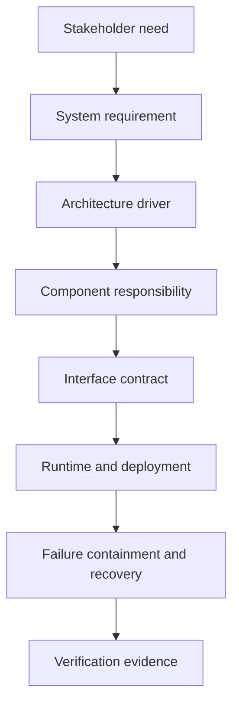

# System and Software Architecture Practice

아키텍처는 UML을 많이 그리는 활동이 아니라, 충돌하는 요구사항과 제약에서 책임·경계·budget·failure policy를 결정하고 검증하는 활동입니다.

## Decision chain



## Architecture drivers

- functional behavior
- latency/deadline/jitter
- CPU, memory, flash, network bandwidth
- startup/shutdown/update time
- availability and degraded/safe state
- failure containment
- interface version and compatibility
- data ownership and freshness
- process/task/thread model
- deployment and privilege boundary
- update and rollback strategy
- observability and diagnosability
- testability and reproducibility

## Required artifacts

| Artifact | Question it must answer |
| --- | --- |
| System context | 시스템과 외부 actor/boundary는 무엇인가? |
| Component diagram | 각 책임과 dependency는 어디에 있는가? |
| Deployment diagram | 어떤 node/process/task에 배치되는가? |
| Sequence diagram | 정상·timeout·recovery 순서는 무엇인가? |
| State machine | 허용된 state/transition/invariant는 무엇인가? |
| Interface specification | data, unit, rate, version, error contract는 무엇인가? |
| Timing budget | end-to-end deadline을 누가 얼마나 사용하는가? |
| Memory/CPU budget | peak와 margin을 어떻게 정했는가? |
| Failure mode table | fault detection, containment, response, evidence는 무엇인가? |
| Threat model | asset, attacker, boundary, mitigation, residual risk는 무엇인가? |
| Traceability | requirement가 code/test/result까지 연결되는가? |

## Budget example

```text
Sensor sample to SOME/IP event deadline: 20 ms
  MCU sampling and processing:       3 ms
  RTOS queue and CAN scheduling:     4 ms
  CAN transmission and gateway:      5 ms
  Linux decode and service publish:  4 ms
  Network/client allowance:          2 ms
  Margin:                            2 ms
```

평균값이 budget을 만족하는 것만으로 충분하지 않습니다. worst observed, p99, sample count, overload behavior와 측정 한계를 함께 기록합니다.

## Failure design

각 fault에 다음을 작성합니다.

| Field | Meaning |
| --- | --- |
| Fault | 무엇이 잘못되는가? |
| Detection | 누가 어떤 signal로 감지하는가? |
| Containment | 어디까지 영향이 퍼질 수 있는가? |
| State response | safe/degraded/retry/reset/rollback 중 무엇인가? |
| Time bound | 감지와 복구 deadline은 얼마인가? |
| Data integrity | stale/corrupt/partial data를 어떻게 처리하는가? |
| Evidence | 어떤 test/trace/metric이 증명하는가? |

## Requirement decomposition

```text
Stakeholder need
  → SYS Requirement
    → SW Requirement
      → Architecture component/interface
        → Unit
          → Unit test
            → Integration/fault test
              → Measured result
```

ID만 연결하고 내용이 모순되면 traceability가 아닙니다. 요구사항 변경 시 downstream artifact와 regression test를 함께 검토합니다.

## Design review questions

- 이 책임이 다른 component에 있으면 어떤 coupling이 생기는가?
- timeout, retry, duplicate request에서 state가 모호하지 않은가?
- data의 owner와 lifetime은 누구인가?
- queue가 가득 차면 block/drop/overwrite 중 무엇이며 왜 그런가?
- MCU reset과 Linux restart가 동시에 발생하면 recovery order는 무엇인가?
- version이 다른 두 node가 부분 배포되면 어떻게 되는가?
- logging 자체가 timing/resource fault를 만들 수 있는가?
- 측정 결과가 architecture assumption을 반박하면 무엇을 바꿀 것인가?

## Architecture defense

G11에서는 diagram 발표가 아니라 다음을 수행합니다.

1. 제3자가 requirement change와 hidden fault를 제시한다.
2. 영향 받는 component/interface/budget/test를 즉석에서 추적한다.
3. 두 대안과 trade-off를 제시한다.
4. 결정 뒤 필요한 측정과 regression test를 정의한다.
5. 불확실한 사실은 추가 evidence가 필요하다고 표시한다.

