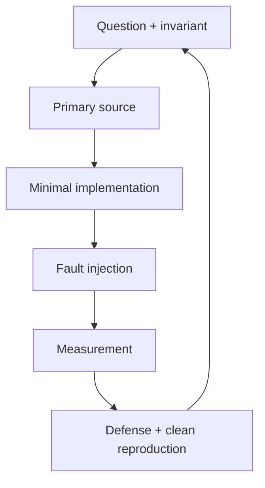
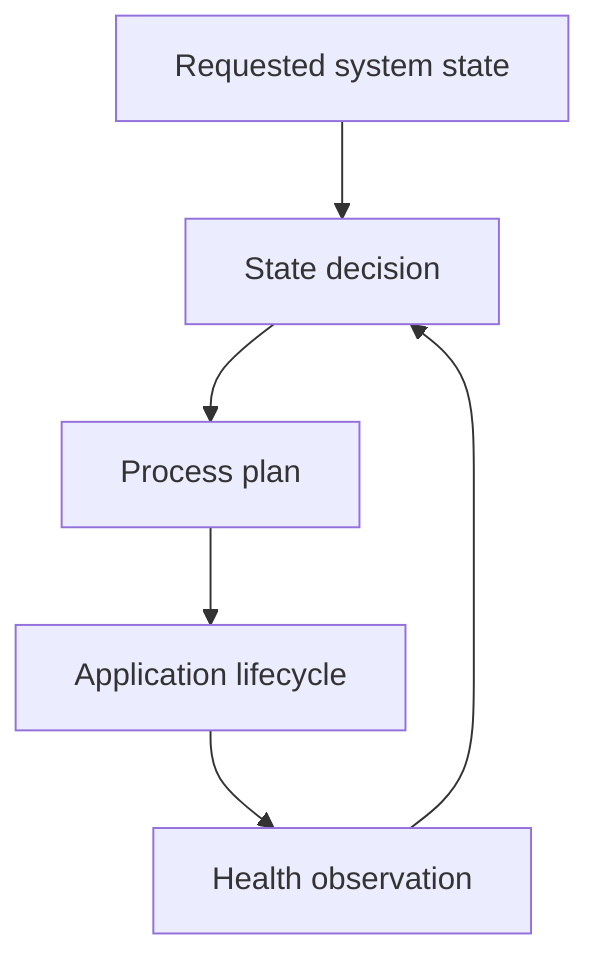

# Learning Strategy

이 커리큘럼은 자료를 순서대로 소비하는 과정이 아닙니다. **질문 → 1차 근거 → 최소 구현 → 고장 주입 → 측정 → 설명 → 독립 재현**을 반복하고, [마스터리 평가](../ASSESSMENTS.md)를 통과할 때만 다음 Gate로 이동합니다.

## 학습 순서와 이유

| Order | Domain | 먼저 증명할 것 | 다음 단계에 주는 기반 |
| ---: | --- | --- | --- |
| 1 | Systems C/C++ | object/lifetime/bounds/concurrency contract | 신뢰할 수 있는 parser·queue·runtime |
| 2 | ARM/LLVM | ABI, memory, linker, generated code | MCU fault와 성능의 원인 분석 |
| 3 | Bare-metal/RTOS | interrupt, task, deadline, stack, watchdog | 실제 ECU의 timing/failure model |
| 4 | Classic concepts | CAN→COM/RTE, UDS→DCM, DTC→NvM 흐름 | ECU 내부 계층과 책임 경계 |
| 5 | Linux/QNX | process, IPC, scheduling, observability | 고성능 차량 컴퓨터 runtime |
| 6 | Vehicle networks | CAN/ISO-TP/UDS와 SOME/IP/DoIP | MCU–Linux end-to-end contract |
| 7 | Adaptive concepts | EM/SM/PHM/COM/PER/UCM 책임 | managed Linux vehicle node |
| 8 | Security/architecture | trust, update, budget, containment | 통합 플랫폼과 설계 방어 |

Adaptive 문서를 먼저 암기하면 아래 계층의 실패 특성을 API 이름으로 가릴 수 있습니다. 반대로 C/RTOS만 반복하면 시스템 계약과 배포·복구 설계를 놓칩니다. 그래서 Gate 순서는 아래 계층에서 위 계층으로 올라가되, compiler analysis와 security review를 매 Gate에 다시 적용합니다.

## 한 학습 단위의 7단계

1. `Question`: 답이 달라지면 설계가 달라지는 질문을 1–3개 정합니다.
2. `Primary source`: 공식 사양, ABI, 프로젝트 문서, upstream source/test에서 근거를 찾습니다.
3. `Minimal model`: state, invariant, timing, ownership, failure를 작은 모델로 적습니다.
4. `Implementation`: 외부 라이브러리 뒤에 숨기 전에 핵심 동작을 최소 구현합니다.
5. `Break it`: malformed input, timeout, overload, restart, corruption 중 관련 fault를 주입합니다.
6. `Measure`: raw data를 남기고 환경·표본·분포·한계를 함께 기록합니다.
7. `Explain/reproduce`: 노트 없이 설명하고 빈 환경 또는 빈 저장소에서 핵심을 재현합니다.



문서 요약, 동작 화면, 평균 수치 하나만 남았다면 완료가 아닙니다.

## Gate 안에서의 시간 배분

- 60%: 직접 구현, 테스트, 디버깅
- 15%: 공식 문서와 upstream source 읽기
- 10%: measurement와 보고서 재생성
- 10%: compiler/assembly/LLVM 분석
- 5%: closed-book 설명, code review, 회고

G10처럼 security가 중심인 Gate에서는 비율을 조정할 수 있지만, 직접 구현과 검증이 전체의 절반 아래로 내려가지 않게 합니다.

## Classic Platform을 공부하는 방법

전체 BSW를 흉내 내지 않습니다. 먼저 세 개의 관찰 가능한 경로를 끝까지 연결합니다.

```text
CAN RX → CanIf-like → PduR-like → COM-like → RTE-like → Application
UDS RX → CanTp-like → PduR-like → DCM-like → Application → response
Fault → DEM-like event/DTC → NvM-like journal → reboot restore
```

각 adapter에는 입력, 출력, state, buffer ownership, timeout, overflow 정책을 적습니다. 공식 module의 책임과 단순화한 부분은 [AUTOSAR 매핑](autosar-mapping.md)에 분리합니다.

## Linux와 Adaptive Platform을 공부하는 방법

먼저 POSIX process lifecycle, signal, IPC, socket, multicast, scheduling과 observability를 직접 확인합니다. 그다음 Adaptive Platform 소개와 Software Architecture 문서를 읽고 다음 경계를 코드로 검증합니다.

- State Management는 목표 상태를 결정하고 Execution Management는 process plan을 수행합니다.
- Platform Health Management는 observation을 제공하지만 모든 system policy를 소유하지 않습니다.
- Communication Management의 service contract와 SOME/IP wire behavior는 같은 층이 아닙니다.
- Persistency와 Update는 crash consistency와 state policy 없이 파일 복사로 끝나지 않습니다.



`ara::*` API를 흉내 내는 것보다 observable contract, failure recovery와 deliberate difference를 먼저 증명합니다.

## LLVM과 오픈소스 트랙

매 Gate에서 중요한 함수 하나를 [compiler analysis corpus](../compiler-analysis/README.md)에 추가합니다. C/C++, GCC/Clang, optimization, Cortex-M/AArch64를 같은 입력과 검증으로 비교합니다. G3 이후에는 작은 upstream issue를 재현하고, 가능하면 test-first 문서·테스트·버그 수정 기여를 시도합니다.

대형 플랫폼 전체 빌드는 목표가 아닙니다. 자체 프로젝트의 문제와 연결되는 subsystem, source file, test를 좁혀 읽습니다.

## AI 사용과 독립성 검증

AI는 설명 비교, 반례 후보, code review에 사용할 수 있습니다. 다만 생성한 코드를 병합하기 전 state/invariant, ownership, concurrency boundary, failure cleanup과 test의 목적을 스스로 설명해야 합니다. Gate의 blank-page, hidden-fault, architecture defense는 초기 힌트 없이 수행합니다.

## 중단·복구 규칙

- 2주 연속 재현 가능한 결과물이 없으면 범위를 절반으로 줄입니다.
- 같은 fault에 세 번 막히면 symptom/가설/관찰을 분리한 debugging log를 작성합니다.
- hardware가 막히면 simulator/native contract test로 계속하되 hardware 가정은 `Unverified`로 남깁니다.
- Gate 통과 실패는 일정 실패가 아니라 결손 skill을 찾은 결과입니다. 부족한 dimension만 1–2주 보강하고 재시험합니다.
- 2주·6주·12주·6개월 간격의 유지 시험에서 실패하면 `Needs refresh`로 표시합니다.

## 매주 남길 최소 증거

- 질문과 예상 실패 조건
- 공식 근거의 문서명·version/commit·section
- build/test/fault 명령
- 실패한 시도와 root cause 또는 다음 가설
- raw evidence와 재생성 script
- 노트 없이 설명한 내용
- `Unverified`와 다음 action

주차는 기록 단위일 뿐 승급 단위가 아닙니다. Gate 통과 여부는 [mastery review template](templates/mastery-review.md)과 GitHub `Mastery gate review` 이슈로 결정합니다.
