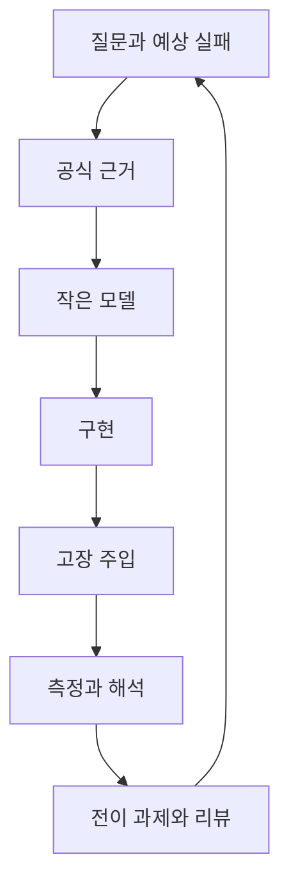
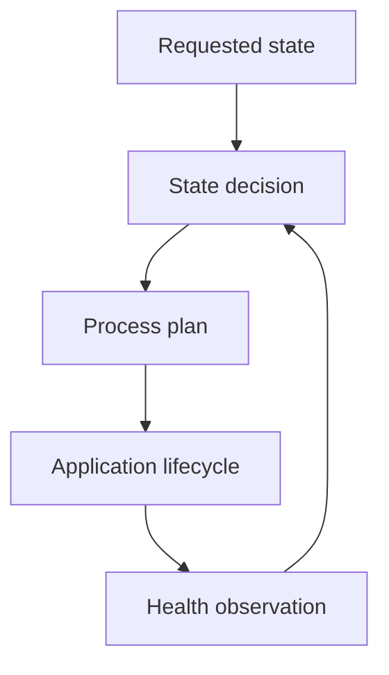

# Learning Strategy

한 학습 단위는 질문에서 시작해 독립 재현으로 끝납니다.



## 한 단위의 진행

1. 답에 따라 설계가 달라지는 질문을 고릅니다.
2. 공식 사양, ABI, upstream 문서·source·test에서 근거를 찾습니다.
3. state, invariant, ownership, timing, failure를 작은 모델로 적습니다.
4. test oracle을 먼저 정하고 최소 구현을 만듭니다.
5. malformed input, timeout, overload, restart, corruption 중 관련 fault를 넣습니다.
6. 환경과 원본 자료를 남기고 결과를 해석합니다.
7. 표면이 다른 과제로 전이한 뒤 reviewer 의견을 반영합니다.

## 주간 시간표

주 12–15시간의 기본 배분입니다.

| 활동 | 비중 | 예시 |
| --- | ---: | --- |
| 현재 Gate 구현·실험 | 70% | lab, test, debugging, hardware |
| 누적 회상·전이 | 15% | 이전 Gate 문제, clean build |
| review·문서·계획 | 10% | PR, evidence, 회고 |
| LLVM/codegen 분석 | 5% | 현재 Gate 함수 한 개 |

LLVM이 핵심인 G3와 장기 유지·이식 단계에서는 비중을 늘립니다. 유지 시험과 문서 시간도 전체 12–15시간 안에서 계산합니다.

## Source 읽기

자료는 세 층으로 사용합니다.

1. 검증된 교재·공식 tutorial로 처음 구조를 잡습니다.
2. 공식 규격과 ABI에서 용어·요구·경계를 확인합니다.
3. upstream source와 test에서 실제 동작과 예외를 확인합니다.

Gate 시작 이슈에 문서명, release/edition/commit, 읽을 절, 학습 목적을 적습니다. 직접 열람하지 못한 normative detail은 `Unverified`로 표시합니다.

## 피드백

| 시점 | 피드백 공급원 |
| --- | --- |
| lab 중 | compiler, sanitizer, property/model test, second implementation |
| Sprint 끝 | PR self-review와 동료/멘토 review |
| Major Gate | sealed fault와 외부 reviewer |
| release 뒤 | clean reproduction과 사용자 issue |
| G12 이후 | upstream maintainer와 장기 회귀 관찰 |

자동 oracle이 부족하면 먼저 oracle을 만듭니다. 사람 검토가 필요한 설계 판단은 `Provisional` 상태로 관리합니다.

## Classic Platform 학습

세 경로를 순서대로 완성합니다.

```text
CAN RX → CanIf-like → PduR-like → COM-like → RTE-like → Application
UDS RX → CanTp-like → PduR-like → DCM-like → Application → response
Fault → DEM-like event/DTC → NvM-like journal → reboot restore
```

각 component에 input, output, state, buffer ownership, timeout, overflow 정책을 적습니다. G7에서는 작은 schema를 generated static configuration으로 바꾸는 실습을 추가합니다. 공식 module과 local 구현의 차이는 [AUTOSAR mapping](autosar-mapping.md)에 기록합니다.

## Linux와 Adaptive Platform 학습

G8에서 process, IPC, scheduling, image, observability를 직접 다룹니다. G9에서 SOME/IP/DoIP의 wire behavior를 확인하고, G10에서 Adaptive functional cluster와 manifest 책임을 연결합니다.



State Management는 목표 상태를 결정하고, Execution Management는 process plan을 실행합니다. Health observation은 정책 결정에 필요한 입력으로 사용합니다. API 이름보다 observable behavior, failure recovery, mapping evidence를 우선합니다.

## LLVM과 OSS

각 Gate의 중요 함수 하나를 [compiler analysis corpus](../compiler-analysis/README.md)에 추가합니다. 비교 조건은 compiler version, target triple, CPU, ABI, flags, linker, workload로 고정합니다.

Upstream 활동은 다음 순서를 따릅니다.

1. source UB와 compiler issue를 분리합니다.
2. 작은 source/IR reproducer를 만듭니다.
3. 기대 동작과 failing test를 작성합니다.
4. issue 또는 patch를 올리고 feedback을 기록합니다.
5. merge 여부와 별개로 local 가정을 수정합니다.

## 중단과 복구

- 두 Sprint 연속 core artifact가 없으면 stretch 범위를 제거합니다.
- 같은 fault에 세 번 막히면 증상·가설·관찰·결론을 시간 순서로 씁니다.
- 장비가 막히면 simulator contract test를 진행하고 hardware 항목을 `Unverified`로 둡니다.
- 선수 기술 유지 시험에 실패하면 1주 gap Sprint를 먼저 수행합니다.
- 일정은 G0–G2의 실제 시간 기록을 기준으로 분기마다 다시 계산합니다.

## 매주 남길 최소 기록

- 질문과 예상 실패
- source의 문서명·version/commit·절
- build/test/fault 명령
- 실패한 시도와 다음 가설
- 원본 자료와 재생성 script
- 도움 없이 수행한 설명 또는 구현
- reviewer 의견과 남은 위험

주차는 기록 단위입니다. 승급은 [ASSESSMENTS.md](../ASSESSMENTS.md)의 lab exit 또는 Major Gate 결과로 결정합니다.
