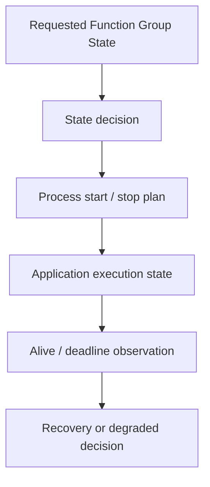
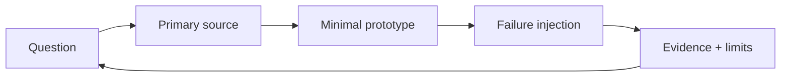

# Learning Strategy

AUTOSAR 문서를 처음부터 끝까지 읽는 방식으로 진행하지 않습니다. **아키텍처 질문 → 최소 구현 → 관련 사양 재확인 → 장애 실험**을 반복합니다.

## 1. 전체 구조

먼저 [Adaptive Platform 소개](https://www.autosar.org/standards/adaptive-platform/)와 [R25-11 Software Architecture explanation](https://www.autosar.org/fileadmin/standards/R25-11/AP/AUTOSAR_AP_EXP_SWArchitecture.pdf)을 읽습니다.

API 이름보다 다음 관계에 답하는 것이 목표입니다.

- Adaptive Application이 프로세스 단위인 이유
- Execution Management와 State Management의 책임 차이
- service interface와 service instance의 차이
- Manifest가 실행·배포에 주는 정보
- Classic signal/RTE와 Adaptive service-oriented model의 차이

답을 [week-01 기록](../study/week-01/README.md)에 자기 말로 작성한 뒤 Process Supervisor를 시작합니다.

## 2. 통신

다음 순서로 학습합니다.

1. TCP/UDP와 multicast interface
2. SOME/IP header와 message type
3. SOME/IP Service Discovery
4. Service/Instance/Method/Event/Field
5. Proxy/Skeleton 개념
6. serialization과 interface version
7. E2E protection의 목적과 보안 인증과의 차이
8. `ara::com`의 책임과 공개 실습 구현의 차이

먼저 직접 socket으로 실패 특성을 확인하고, 그다음 vsomeip을 사용합니다. CommonAPI C++는 직접 API와 wire behavior를 이해한 뒤 선택적으로 도입합니다.

## 3. 실행·상태·배포

Vehicle State Service의 발견과 재연결을 증명한 다음 아래를 읽습니다.

- Execution Management
- State Management
- Adaptive methodology
- Manifest specification
- Platform Health Management

구현 순서도 동일합니다.

실제 사양의 책임을 단순 YAML 모델로 줄일 때, 무엇을 잃었는지 [AUTOSAR 매핑](autosar-mapping.md)에 기록합니다.

## 4. 운영·보안 기능

기본 lifecycle이 동작한 뒤 다음 순서로 확장합니다.

1. Persistency
2. Log and Trace
3. Diagnostics
4. Update and Configuration Management
5. Cryptography
6. Identity and Access Management
7. Network policy/firewall

UCM은 파일 복사가 아니라 검증, staging, activation, health check, rollback, journal과 상태 정책의 묶음으로 구현합니다. OP-TEE는 기본 업데이트 경로를 끝낸 뒤 key/version 보호 확장으로 추가합니다.

## 5. S-CORE와 오픈소스 기여

[Eclipse S-CORE](https://eclipse-score.github.io/score/main/)는 초반 빌드 목표가 아니라 다음 용도로 후반에 참고합니다.

- 요구사항 ID와 테스트 추적성
- CI, devcontainer, work product 구조
- Persistency/SOME-IP 관련 모듈 코드 읽기
- 작은 테스트·문서·버그 수정 PR

자체 프로젝트가 동작하기 전에 대형 플랫폼 전체 빌드에 매달리면 학습 목표가 환경 구축으로 바뀔 가능성이 큽니다.

## 각 주의 반복 루프

한 주가 끝났는데 남은 것이 문서 요약뿐이라면 통과하지 않은 것으로 판단합니다.

