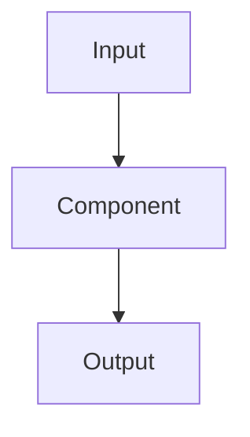

# Project NN: Name

## Problem

이 프로젝트가 해결하거나 검증할 차량 플랫폼 문제를 한 문단으로 작성합니다.

## Scope

### In scope

- 

### Out of scope

- 

## 관련 표준과 적용 범위

| Local element | Related standard / concept | 확인한 호환 범위 | 의도적으로 뺀 범위 |
| --- | --- | --- | --- |
|  |  |  |  |

## Requirements

- `REQ-...`

## Architecture



## Build and run

```bash
# 깨끗한 Ubuntu 환경에서 실행 가능한 명령
```

## Verification

| Scenario | Expected result | Automated test / evidence |
| --- | --- | --- |
| Normal |  |  |
| Invalid input |  |  |
| Dependency unavailable |  |  |
| Resource exhaustion |  |  |

## Results

이 프로젝트에 맞는 인수 예산과 수치를 기록합니다. MCU에는 response-time analysis, measured worst, jitter, stack을 사용하고 Linux에는 latency distribution, CPU, RSS, recovery time을 사용합니다.

## 확인한 범위와 남은 일

- Verified:
- Provisional:
- Out of scope:
- Next release:
