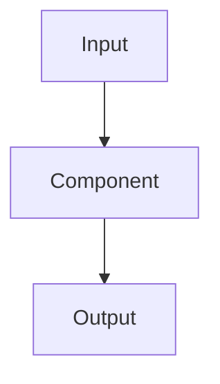

# Project NN: Name

## Problem

이 프로젝트가 해결하거나 검증할 차량 플랫폼 문제를 한 문단으로 작성합니다.

## Scope

### In scope

- 

### Out of scope

- 

## Related concepts

| Local element | Related Adaptive concept | Difference |
| --- | --- | --- |
|  |  |  |

## Requirements

- `REQ-...`

## Architecture



## Build and run

```bash
# 깨끗한 Ubuntu 환경에서 실행 가능한 명령
```

## Verification

| Scenario | Expected result | Automated test / evidence |
| --- | --- | --- |
| Normal |  |  |
| Invalid input |  |  |
| Dependency unavailable |  |  |
| Resource exhaustion |  |  |

## Results

측정 환경과 p50/p95/p99, CPU, RSS, recovery time 중 관련 수치를 기록합니다.

## Limitations

- AUTOSAR compliance를 검증하지 않음
- 

