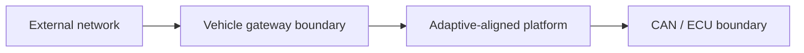

# Threat Model: System or Feature

## Scope and assumptions

- In scope:
- Out of scope:
- Trusted assumptions:

## Assets

| Asset | Security property | Impact if compromised |
| --- | --- | --- |
| Update signing key | Confidentiality / authenticity |  |
| Installed software version | Integrity / rollback resistance |  |
| Vehicle state data | Integrity / freshness |  |
| Diagnostic capability | Authorization / auditability |  |

## Trust boundaries

## Abuse cases

| ID | Attacker capability | Attack path | Impact | Existing control | Residual risk | Test |
| --- | --- | --- | --- | --- | --- | --- |
| TM-001 |  |  |  |  |  |  |

## Security invariants

- An unverified update is never staged or activated.
- A diagnostic request outside policy is never forwarded to CAN.
- A failed update cannot remove the last known-good bootable version.

## Open risks

- 

