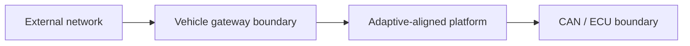

# Threat Model: System or Feature

## Scope and assumptions

- Assurance tier: T0 / T1 / T2 / T3 / T4
- In scope:
- Out of scope:
- Trusted assumptions:
- Trust root and protected state actually available:
- 상위 tier에서만 쓸 수 있는 표현:

## Assets

| Asset | Security property | Impact if compromised |
| --- | --- | --- |
| Update signing key | Confidentiality / authenticity |  |
| Installed software version | Integrity / rollback resistance |  |
| Vehicle state data | Integrity / freshness |  |
| Diagnostic capability | Authorization / auditability |  |

## Trust boundaries

## Abuse cases

| ID | Attacker capability | Attack path | Impact | Existing control | Residual risk | Test |
| --- | --- | --- | --- | --- | --- | --- |
| TM-001 |  |  |  |  |  |  |

## Security invariants

- T2+: A package whose authenticity or payload integrity has not passed is never staged or activated.
- A diagnostic request outside policy is never forwarded to CAN.
- T1+: A failed transaction leaves the previous committed slot or the documented recovery state available.
- T3: A lower version cannot pass the protected minimum-version check.

## Open risks

- 
