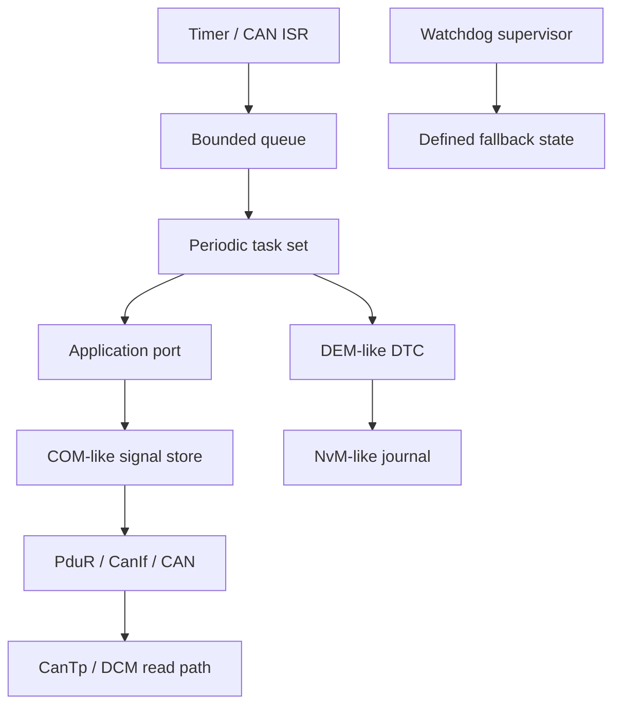

# P00 — MCU/RTOS ECU Node

Status: Planned

P00은 세 번 release합니다. 각 release는 해당 Gate에서 배운 내용만 사용합니다.

| Release | Gate | 범위 |
| --- | --- | --- |
| P00-A | G5 | RTOS task set, RTA, timing, queue, watchdog |
| P00-B | G6 | CAN/CAN FD, ISO-TP, UDS read path, physical bus fault |
| P00-C | G7 | Classic concept communication·diagnostic·DTC vertical slice |

## P00-A — RTOS Timing Core

### 기능

- 요구사항에서 도출한 periodic·sporadic task set
- synthetic sensor와 defined output state
- bounded ISR-to-task queue
- watchdog과 deterministic fallback policy
- monotonic timing recorder와 stack/queue counters

### Timing contract

| Field | 작성 시점 | 내용 |
| --- | --- | --- |
| Functional deadline | 구현 전 | 상위 기능 요구에서 도출 |
| Task allocation | 구현 전 | period, deadline, priority, release model |
| Provisional WCET estimate | 구현 전 | 근거와 uncertainty 포함 |
| Response-time bound | 구현 전 | blocking, ISR, jitter, interference 포함 |
| Measured distribution | 구현 후 | p50/p95/p99/measured worst와 환경 |
| Acceptance decision | 시험 후 | analytical·measured evidence와 margin |

1ms/10ms/100ms는 예제 값으로만 사용할 수 있습니다. 최종 task period와 deadline은 synthetic stakeholder requirement에 연결합니다.

### P00-A Exit

- task model과 fixed-priority response-time analysis
- priority inversion·overload·queue saturation fault
- workload phase와 interrupt load를 나눈 soak test
- timing·stack·queue 원본 자료와 재생성 script
- watchdog detection·recovery 시간과 reset reason

## P00-B — CAN and Diagnostics Extension

### 기능

- CAN/CAN FD driver boundary와 bounded TX/RX queue
- DBC-style signal encode/decode
- ISO-TP sender/receiver state machine
- read-focused UDS endpoint와 timer/session policy
- physical bus-off detection과 bounded recovery

### 필수 실험

| Scenario | Evidence |
| --- | --- |
| arbitration/load change | calculated and measured response time |
| Classic/FD mixed traffic | DLC code 0–15와 payload length 0–64의 정확한 대응, frame type, BRS·ESI 판정 기록 |
| nominal/data bit-rate change | controller·transceiver capability, controller counter, 가능한 경우 differential scope trace |
| termination or bit-rate mismatch | controller error evidence; 적합한 scope·differential probe가 없으면 analog 판정은 `Unverified` |
| bus-off | error state, unavailable state, recovery trace |
| ISO-TP sequence/timer fault | packet trace and state assertion |
| UDS malformed/unauthorized request | NRC/reject and unchanged application state |
| flood | queue peak, drops, CPU/task impact |

### P00-B Exit

- vcan과 physical bench 결과를 분리한 보고서
- CAN FD nominal/data phase와 BRS를 포함한 부하·응답시간 분석
- Linux ISO-TP 또는 별도 tester와 상호 운용
- 실제 bus-off fault와 복구 정책
- 진단 write·download가 비활성화된 access policy
- `Validated` 판정에는 교정한 oscilloscope·differential probe의 정상·fault waveform이 필요하며, 장비가 없으면 `Provisional`로 종료

## P00-C — Classic Concept Stack

### 경로

```text
CAN RX → CanIf-like → PduR-like → COM-like → RTE-like → Application
UDS RX → CanTp-like → PduR-like → DCM-like → Application → response
Fault → DEM-like event/DTC → NvM-like journal → reboot restore
```

### 기능

- static route·signal·runnable configuration
- 작은 schema에서 generated configuration 생성
- DTC status/snapshot과 persistent restore
- startup, diagnostic, degraded, shutdown mode state
- watchdog supervision과 communication-state interaction

### P00-C Exit

- 세 경로의 packet·call·state trace
- timeout, NRC, storage corruption, startup mode negative tests
- official release·문서 절과 local implementation mapping
- P00 v1 clean-board release와 외부 review

## Architecture



## Requirements

- G4 runtime: `REQ-MCU-START-001`–`REQ-MCU-WDG-001`
- P00-A: `REQ-RTOS-001`–`REQ-RTOS-006`, `REQ-FALLBACK-001`
- P00-B: `REQ-CAN-001`–`REQ-CAN-007`, `REQ-ECU-DIAG-001`–`REQ-ECU-DIAG-003`
- P00-C: `REQ-DTC-001`–`REQ-DTC-002`, `REQ-CP-OS-001`–`REQ-CP-SEC-001`

## 결과물 이름과 적용 범위

결과물 이름은 `Classic concept-aligned prototype`으로 표기하고, 호환성·인증 범위는 저장소 [README](../../README.md)의 기준을 따릅니다. G4에서는 기본 boot/fallback 경로만 다룹니다. `REQ-BOOT-001`–`003`의 신뢰 사슬은 P04-T3에서 실제 hardware root를 갖춘 뒤 검증합니다.
