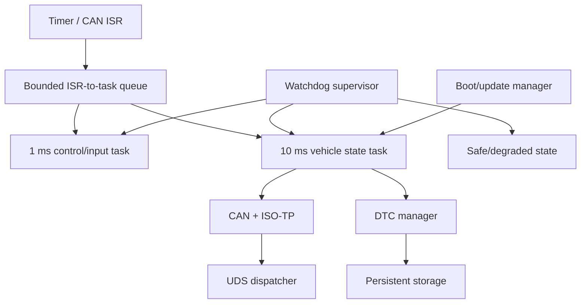

# P00 — MCU/RTOS ECU Node

Status: Planned

## Problem

제한된 CPU·RAM·flash와 실시간 제약 아래에서 sensor data를 처리하고 CAN/UDS로 통신하며, task overrun·bus-off·watchdog reset·storage failure에서 정의된 상태로 복구하는 ECU node를 구현합니다.

초기에는 QEMU/native simulation 또는 개발 보드에서 시작하고, 특정 MCU vendor HAL에 종속되기 전에 scheduler/timing/driver contract를 분리합니다.

## Functional scope

- 1ms/10ms/100ms periodic task set
- sensor and actuator simulation
- CAN/CAN FD abstraction and bounded TX/RX queue
- DBC-like signal encode/decode
- ISO-TP and read-focused UDS services
- DTC event/status and persistent restore
- watchdog and safe/degraded state
- bus-off detection/recovery policy
- firmware version and flash layout
- bootloader/update protocol prototype

## Architecture

## Timing contract

| Task | Period | Deadline | Initial budget | Failure policy |
| --- | ---: | ---: | ---: | --- |
| Fast input/control | 1 ms | 1 ms | measured, then fixed | safe output after consecutive misses |
| Vehicle state | 10 ms | 10 ms | measured, then fixed | stale flag and degraded state |
| Diagnostics | event-driven | bounded response | queue/timeout policy | NRC or timeout, never unbounded block |
| DTC persistence | 100 ms/background | defined flush bound | write budget | journal/retry with wear assumption noted |
| Watchdog supervision | 10 ms | defined detection bound | minimal | reset or safe state by policy |

예산 숫자는 측정 전 임의로 확정하지 않습니다. 첫 baseline 뒤 hardware와 workload를 명시해 채웁니다.

## Related requirements

- `REQ-RTOS-001`–`REQ-RTOS-004`
- `REQ-CAN-001`–`REQ-CAN-003`
- `REQ-DIAG-001`–`REQ-DIAG-003`
- `REQ-BOOT-001`–`REQ-BOOT-003`
- `REQ-SAFE-001`

## Milestones

- [ ] P00-M1: startup, timer, interrupt, fault record
- [ ] P00-M2: periodic task set and timing recorder
- [ ] P00-M3: CAN queue and signal encoding
- [ ] P00-M4: ISO-TP/UDS read path
- [ ] P00-M5: DTC and persistent state
- [ ] P00-M6: watchdog, overrun and safe-state policy
- [ ] P00-M7: boot/update and fallback prototype
- [ ] P00-M8: 100,000-release report and Gate assessment

## Required measurements

| Metric | Required output |
| --- | --- |
| execution time | p50/p95/p99/worst per task |
| release jitter | distribution and maximum |
| deadline | misses / total releases |
| stack | high-water mark per task plus margin |
| queue | peak depth, drops, overflow policy |
| watchdog | detection and recovery time |
| CAN | load, latency, bus-off recovery time |
| flash | image/section size and persistent write behavior |

## Fault campaign

| Fault | Expected behavior |
| --- | --- |
| task exceeds budget | overrun recorded; configured degraded/safe action |
| high-priority task starves low task | supervision detects deadline miss |
| priority inversion | reproduced, then bounded with protocol/policy |
| CAN RX flood | bounded queue and explicit drop counter |
| bus-off | communication unavailable state and bounded recovery attempt |
| malformed ISO-TP/UDS | reject without memory/state corruption |
| persistent record corruption | default/recovery path and DTC/audit evidence |
| watchdog reset | reset reason retained; output enters safe state |
| update interrupted | active known-good image remains bootable |

## Explicit non-goals

- production safety certification
- AUTOSAR Classic conformance
- actual vehicle actuator control
- vendor-specific MCAL clone
- cryptographic boot root before basic boot/recovery correctness

## Completion evidence

- clean board/simulator setup and one-command test
- task/ISR/thread model and timing budget
- raw timing/stack/queue data with analysis script
- CAN/ISO-TP/UDS packet evidence
- fault register and watchdog/bus-off postmortem
- Classic concept mapping and deliberate differences
- AI-independent blank-page and fault diagnosis assessment

