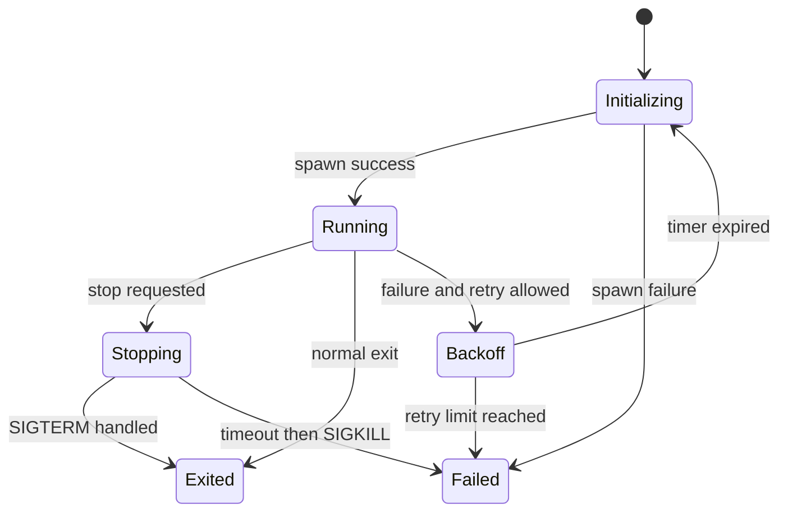

# P01 — Process Supervisor

Status: Planned

## 문제

Adaptive-style lifecycle을 학습하기 전에, Linux 프로세스를 예측 가능하게 시작·관찰·종료·재시작하는 최소 Supervisor를 구현합니다. 프로세스 관리와 복구 정책을 섞지 않고 테스트 가능한 상태 머신으로 만드는 것이 핵심입니다.

## 학습 목표

- `posix_spawn` 또는 `fork/exec`의 실패 경로
- PID, process group, exit status, signal semantics
- graceful shutdown, timeout, forced termination
- restart limit과 exponential backoff
- 비동기 자식 종료 처리와 race condition
- clock과 process launcher를 대체 가능한 테스트 구조

## 범위

### 구현

- 단일/복수 child process 실행
- `Initializing`, `Running`, `Stopping`, `Exited`, `Failed`, `Backoff` 상태
- SIGTERM → timeout → SIGKILL 종료 정책
- `never`, `on-failure`, `always` 재시작 정책
- restart limit, backoff, 구조화 로그
- unit/integration/fault tests

### 제외

- `ara::exec` API
- AUTOSAR Manifest/ARXML parser
- cgroup, container orchestration, systemd 대체
- PHM 전체 supervision 모델

## 관련 요구사항

- `REQ-EXEC-002`
- `REQ-EXEC-003`
- `REQ-OBS-001`
- `REQ-QUAL-001`
- `REQ-QUAL-002`

## 상태 모델

## 마일스톤

- [ ] P01-M1: child 실행과 exit status 수집
- [ ] P01-M2: graceful/forced shutdown
- [ ] P01-M3: restart policy와 backoff
- [ ] P01-M4: deterministic unit tests
- [ ] P01-M5: sanitizer와 문서화

## 필수 테스트

| Scenario | Expected result |
| --- | --- |
| executable missing | spawn failure를 분류하고 재시작 loop에 빠지지 않음 |
| child exits 0 | `on-failure` 정책에서 재시작하지 않음 |
| child exits non-zero | 제한 횟수와 backoff에 따라 재시작 |
| child handles SIGTERM | timeout 전에 정상 종료 |
| child ignores SIGTERM | timeout 뒤 SIGKILL, 이유 기록 |
| repeated crash | restart limit 뒤 terminal failure |
| supervisor interrupted | child/process group 정리 정책을 검증 |

## 완료 증거

- build/run 명령
- 상태 전환 다이어그램과 로그 예시
- 실제 시간에 의존하지 않는 backoff test
- ASan/UBSan 실행 결과
- Execution Management와의 매핑 및 차이

