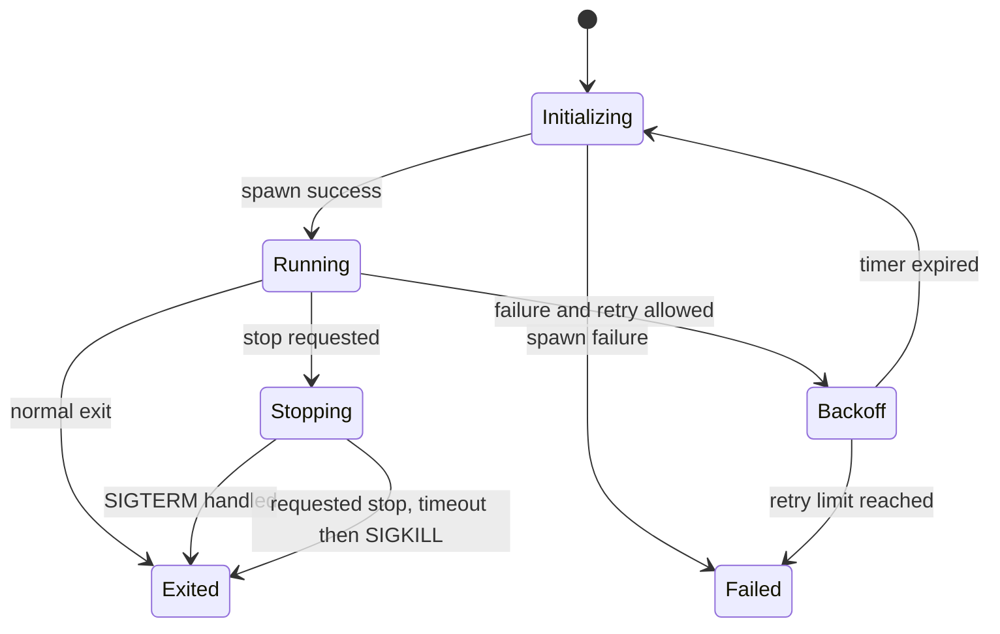

# P01 — Process Supervisor

Status: Planned

## 문제

Linux 프로세스를 예측 가능하게 시작·관찰·종료하는 작은 실행기를 만듭니다. 재시작 여부는 P03의 lifecycle policy가 정하고 P01은 요청받은 action을 실행합니다.

## 학습 목표

- `posix_spawn` 또는 `fork/exec`의 실패 경로
- `pidfd`, process group, cgroup v2, exit status, signal semantics
- graceful shutdown, timeout, forced termination
- PID 재사용과 stale timer 방어
- 비동기 자식 종료 처리와 race condition
- clock과 process launcher를 대체 가능한 테스트 구조

## 범위

### 구현

- 단일/복수 child process 실행
- `Initializing`, `Running`, `Stopping`, `Exited`, `Failed`, `Backoff` 상태
- SIGTERM → timeout → SIGKILL 종료 정책
- 전용 cgroup과 `pidfd` 기반 process instance handle
- `never`, `on-failure`, `always` 정책을 실행하는 P03 adapter
- restart attempt·backoff를 입력으로 받은 action과 구조화 로그
- unit/integration/fault tests

### 제외

- `ara::exec` API
- AUTOSAR Manifest/ARXML parser
- container orchestration과 systemd 대체
- PHM 전체 supervision 모델

## 관련 요구사항

- `REQ-EXEC-002`
- `REQ-EXEC-003`
- `REQ-OBS-001`
- `REQ-QUAL-001`
- `REQ-QUAL-002`
- `REQ-PLAT-002`
- `REQ-PLAT-003`

## 상태 모델

requested stop, observed exit status, graceful/forced 여부는 서로 다른 field로 기록합니다. 요청된 stop에서 SIGKILL이 필요했다는 이유만으로 `on-failure` restart를 시작하지 않습니다. 전체 배치 책임은 [Linux lifecycle 소유권](../../docs/lifecycle-ownership.md)을 따릅니다.

## 마일스톤

- [ ] P01-M1: child 실행과 exit status 수집
- [ ] P01-M2: graceful/forced shutdown
- [ ] P01-M3: restart policy와 backoff
- [ ] P01-M4: deterministic unit tests
- [ ] P01-M5: sanitizer와 문서화

## 필수 테스트

| Scenario | Expected result |
| --- | --- |
| executable missing | spawn failure를 분류하고 재시작 loop에 빠지지 않음 |
| child exits 0 | `on-failure` 정책에서 재시작하지 않음 |
| child exits non-zero | 제한 횟수와 backoff에 따라 재시작 |
| child handles SIGTERM | timeout 전에 정상 종료 |
| child ignores SIGTERM | timeout 뒤 SIGKILL, 이유 기록 |
| repeated crash | restart limit 뒤 terminal failure |
| child calls `setsid()` or double-forks | 전용 cgroup에서 descendant까지 종료·회수 |
| PID is reused before a stale timer fires | 새 process에 signal을 보내지 않고 stale action 거부 |
| supervisor interrupted | subreaper·cgroup 정리 정책을 검증 |

## 완료 증거

- build/run 명령
- 상태 전환 다이어그램과 로그 예시
- 실제 시간에 의존하지 않는 backoff test
- ASan/UBSan 실행 결과
- Execution Management와의 매핑 및 차이
