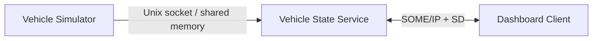

# P02 — SOME/IP Vehicle State Service

Status: Planned

## 문제

차량 상태를 versioned SOME/IP service로 제공합니다. 서비스의 늦은 시작, 네트워크 단절, 프로세스 재시작에서 클라이언트의 availability 전이를 packet과 test로 확인합니다.

## 인터페이스 초안

```text
VehicleStateService
├── Method: GetSnapshot()
├── Method: GetSoftwareVersion()
├── Event: VehicleSpeedChanged
├── Event: GearPositionChanged
└── Field: IgnitionState
```

실제 Service/Instance/Method/Event ID와 major/minor version은 `interface.md`를 만들어 고정합니다.

## 아키텍처



## 범위

### 구현

- vsomeip request/response와 publish/subscribe
- SOME/IP Service Discovery
- availability callback, subscription, reconnection
- bounded event queue와 drop counter
- 10Hz/100Hz workload 측정
- UDP/TCP 전송 방식 비교 실험

### 제외

- `ara::com` API 및 AUTOSAR code generator
- 생산 차량 수준의 schema compatibility
- UI 중심 dashboard
- E2E를 암호학적 인증으로 취급하는 설계

## 관련 요구사항

- `REQ-COM-001`–`REQ-COM-005`
- `REQ-TIME-001`–`REQ-TIME-003`
- `REQ-PERF-001`
- `REQ-QUAL-001`

## Time and availability contract

| Field | Decision |
| --- | --- |
| Source timestamp | clock domain and capture point |
| Sequence | wrap and gap handling |
| Discovery | offer/find/TTL timing |
| Subscription | eventgroup and resubscription policy |
| Freshness | stale and unavailable threshold |
| Latency | clock offset/drift/uncertainty or RTT method |

## 마일스톤

- [ ] P02-M1: 네이티브 2프로세스 request/response
- [ ] P02-M2: event publish/subscribe
- [ ] P02-M3: SD와 availability state
- [ ] P02-M4: restart/reconnect/fault tests
- [ ] P02-M5: Raspberry Pi–노트북 2노드 배포와 측정

## 필수 실험

| Scenario | Observe / measure |
| --- | --- |
| client starts first | server availability까지 discovery time |
| server restarts | unavailable → available 전환과 재구독 |
| network interface interrupted | timeout, recovery time, duplicate event 여부 |
| incompatible major version | 연결 거부 또는 명시적 compatibility policy |
| 10Hz vs 100Hz event | p50/p95/p99 latency, CPU, RSS, drops |
| UDP vs TCP | loss/recovery/head-of-line behavior |
| SD TTL expires | availability transition and resubscription behavior |

## 완료 증거

- 민감 정보 없는 SOME/IP-SD와 SOME/IP 캡처
- 서비스 ID·버전·인터페이스 표
- clean-machine build/run 절차
- 재연결 integration test
- 성능 raw data와 보고서
- `ara::com`과 동일하지 않은 지점 설명
