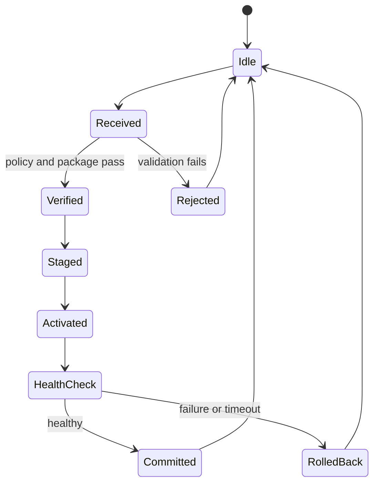

# P04 — Update Assurance Lab

Status: Planned

업데이트 기능을 세 단계로 쌓습니다. T1은 중단 뒤 상태 복구, T2는 package authenticity, T3는 실제 hardware trust root를 사용한 rollback protection을 다룹니다.

## Assurance tiers

| Release | Scope | 결과물에 쓸 표현 |
| --- | --- | --- |
| P04-T1 | journal, staging, atomic activation, health check, rollback | crash-consistent updater |
| P04-T2 | canonical manifest, signature, hash, key policy | authenticated updater |
| P04-T3 | immutable verified root와 protected monotonic state | rollback-protected chain; hardware support가 있을 때 |

## State machine

## Package contract

Manifest에는 package ID, target, version, minimum platform version, payload path·hash·size, signing-key ID, format version을 넣습니다. Serialization 형식과 canonical encoding을 고정합니다.

## Invariants

- validation과 authorization을 마친 package만 staging한다.
- active slot을 staging 작업으로 덮어쓰지 않는다.
- health check 전에는 새 version을 committed로 표시하지 않는다.
- transaction metadata의 durable boundary를 state마다 정의한다.
- interrupted transaction은 이전 version 또는 explicit recovery state로 돌아간다.
- activation policy가 금지한 vehicle state에서는 작업을 시작하지 않는다.
- T2는 signature와 모든 payload hash를 staging 전에 확인한다.
- T3는 boot authenticity와 protected minimum-version state를 확인한다.

## Threat and fault corpus

| Scenario | Expected result |
| --- | --- |
| malformed/duplicate manifest field | parse rejection |
| non-canonical encoding | signature policy에 따른 rejection |
| payload changed or truncated | staging 전 rejection |
| path traversal, absolute path, symlink | destination boundary 유지 |
| file swap during verification | descriptor/identity contract로 차단 |
| unknown or revoked key | authorization failure |
| lower version or replay | policy rejection |
| kill before/after every durable write | reference state로 recovery |
| disk full or short write | active slot 유지, failure audit |
| new service unhealthy | bounded rollback |
| physical power cut | storage/board 조건과 함께 결과 기록 |

Process kill 결과와 실제 power-cut 결과를 별도 표에 기록합니다.

## Trust assumptions

| Assumption | Evidence or limitation |
| --- | --- |
| boot code authenticity | ROM/bootloader capability와 설정 |
| signing key protection | provisioning·storage·rotation·revocation 정책 |
| minimum version protection | monotonic counter 또는 protected storage |
| caller identity | OS credential·certificate·diagnostic principal |
| filesystem durability | rename/fsync/mount semantics와 시험 |
| recovery entry | console, recovery image, service procedure |

환경이 제공하지 않는 보장은 구현 범위에서 뺍니다. 이 경우 P04-T1 또는 T2로 release 이름을 유지합니다.

## Requirements by tier

| Tier | Required IDs |
| --- | --- |
| T1 | `REQ-UCM-004`–`REQ-UCM-006`, `REQ-STATE-001`, `REQ-OBS-001` |
| T2 | T1 + `REQ-UCM-001`, `REQ-UCM-002`, `REQ-UCM-007`, `REQ-SEC-001`, `REQ-SEC-002` |
| T3 | T2 + `REQ-UCM-003`, `REQ-BOOT-001`–`REQ-BOOT-003` |

## Completion

- positive/negative package corpus generator
- reference state model과 crash-at-each-state test
- path·encoding·key·version attack corpus
- durable write boundary가 표시된 sequence
- threat model, TARA, trust assumptions, residual risk
- safety reviewer와 security reviewer의 별도 기록
- UCM 개념과 local format의 mapping
