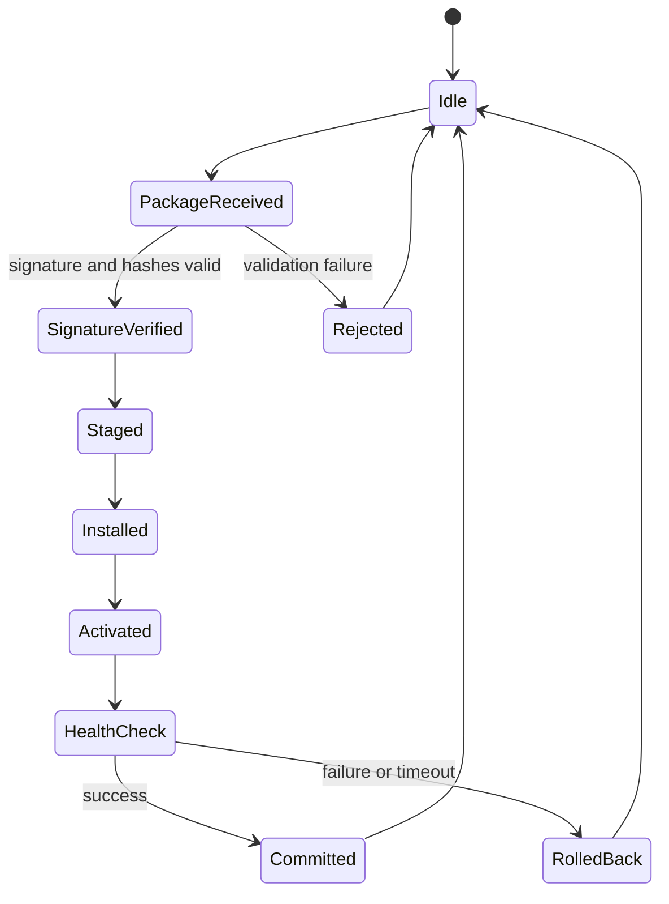

# P04 — Secure Update Manager

Status: Planned

## 문제

정상 패키지만 설치하는 happy-path updater가 아니라, 변조·구버전·부팅 실패·중간 전원 차단에서도 마지막 known-good 버전을 보존하는 업데이트 상태 머신을 구현합니다.

## 상태 머신



## 패키지 초안

```text
update-package/
├── manifest.json
├── payload/
│   ├── vehicle-state-service
│   └── diagnostic-service
└── signature.ed25519
```

`manifest.json`에는 package ID, target, version, payload path/hash/size, minimum platform version과 생성 시각을 명시합니다. certificate chain을 구현하지 않는 초기 버전은 신뢰된 public key를 명시적으로 provision합니다.

## 보안 불변식

- 서명과 모든 payload hash가 검증되기 전에는 staging하지 않는다.
- 현재 또는 persisted minimum보다 낮은 버전을 활성화하지 않는다.
- 활성 슬롯을 덮어쓰지 않는다.
- health check를 통과하기 전에는 새 버전을 committed로 표시하지 않는다.
- 어떤 중단 지점에서도 마지막 known-good 버전이 부팅 가능해야 한다.
- Driving 상태에서는 activation을 시작하지 않는다.

## 범위

### 구현

- canonical manifest parsing과 strict validation
- Ed25519 또는 ECDSA signature verification
- payload hash/size verification
- A/B slots와 atomic active metadata
- post-activation health check
- rollback, downgrade/replay policy
- durable transaction journal
- state transition audit log

### 제외

- 공식 AUTOSAR UCM package/Manifest 형식과 API
- production PKI enrollment와 certificate lifecycle
- bootloader 자체의 secure boot 구현
- OP-TEE 연동은 기본 버전 완료 후 선택 확장

## 관련 요구사항

- `REQ-UCM-001`–`REQ-UCM-005`
- `REQ-STATE-001`
- `REQ-OBS-001`

## 마일스톤

- [ ] P04-M1: package format과 strict parser
- [ ] P04-M2: signature/hash/version verification
- [ ] P04-M3: A/B staging과 activation
- [ ] P04-M4: health check와 rollback
- [ ] P04-M5: crash-at-each-state recovery tests
- [ ] P04-M6: threat model과 선택적 OP-TEE key/version storage

## 공격·장애 테스트

| Scenario | Expected result |
| --- | --- |
| manifest byte changed | signature/hash 검증 단계에서 거부 |
| payload changed or truncated | staging 전 거부 |
| unknown signing key | authorization failure |
| lower version | downgrade 거부 |
| same package replay | idempotent 처리 또는 명시적 거부 |
| new service does not start | health check 실패 후 rollback |
| process killed at every state | journal 기반 defined recovery |
| disk full during staging | active slot 보존, 오류 기록 |
| activation requested in Driving | 정책 거부와 audit event |

## 완료 증거

- positive/negative package corpus 생성 스크립트
- crash-at-each-state 자동 테스트
- A/B slot 전후 metadata와 journal 증거
- threat model 및 residual risk
- UCM 개념과 실제 구현 차이

