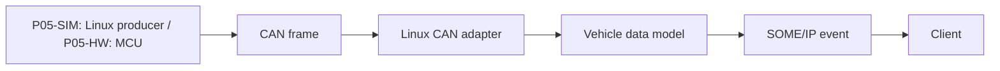

# P05 — CAN–SOME/IP Vertical Slice

Status: Planned

P05는 두 release로 나눕니다. G9의 P05-SIM은 Linux `vcan` producer로 data path를 닫습니다. G6 이후 P05-HW가 실제 MCU, transceiver, bus-off, CAN timing 근거를 추가합니다.

## 기능 범위

- vehicle signal 1–3개
- CAN receive와 bounds validation
- unit·range·rolling counter·source boot/session ID·timestamp·quality 변환
- versioned SOME/IP event 하나
- bounded queue와 stale/unavailable policy
- cross-node correlation log

이번 release의 scope boundary는 DoIP, process manager, update, 전체 차량 signal catalog 앞에서 끝납니다.

## Interface contract

| Field | Decision |
| --- | --- |
| Signal | ID, bit layout, scaling, unit, valid range |
| Rate | expected period와 burst 조건 |
| Freshness | payload rolling counter, source boot/session ID, stale threshold |
| Clock | timestamp domain, offset/drift/uncertainty |
| Queue | capacity와 drop/overwrite policy |
| Version | CAN schema와 SOME/IP major/minor mapping |
| Quality | valid, stale, lost, unavailable 표현 |

## Release별 요구사항

| Release | 필수 요구사항 | 닫지 않는 주장 |
| --- | --- | --- |
| P05-SIM, G9.10 | `REQ-CAN-001`–`002`, `REQ-COM-001`–`005`, `REQ-TIME-001`–`003`, `REQ-ARCH-006` | physical error confinement, bus-off, real CAN response time |
| P05-HW, G6/G12 | P05-SIM + `REQ-CAN-003`–`007` | 하드웨어 timestamp가 없을 때의 정밀 one-way latency |

## Fault scenarios

| Fault | Expected behavior |
| --- | --- |
| truncated/invalid CAN frame | published state를 갱신하지 않고 counter 증가 |
| sequence gap | quality와 loss counter 갱신 |
| source stops | stale 뒤 unavailable 전환 |
| CAN flood | bounded queue, explicit drop, service 생존 |
| SOME/IP client restart | 재발견·재구독 뒤 최신 상태 전달 |
| source restarts and counter resets | boot/session ID 변경으로 새 epoch 시작 |
| clock offset change | uncertainty가 허용 범위를 넘으면 one-way latency claim 중단 |
| P05-HW bus-off | controller error state와 bounded recovery policy 관찰 |
| P05-HW Classic/FD mismatch | decode 전에 frame type을 거부하고 capability 오류 기록 |

## Completion

- two-node clean run script
- P05-SIM의 합성 CAN과 SOME/IP capture
- data·time·version contract test
- latency·drop·recovery 원본 자료
- P05-SIM restart·schema fault 시험
- P05-HW physical bus-off, CAN FD 두 bit-rate 구간, message-set timing 분석
- G12에서 재사용할 versioned release
