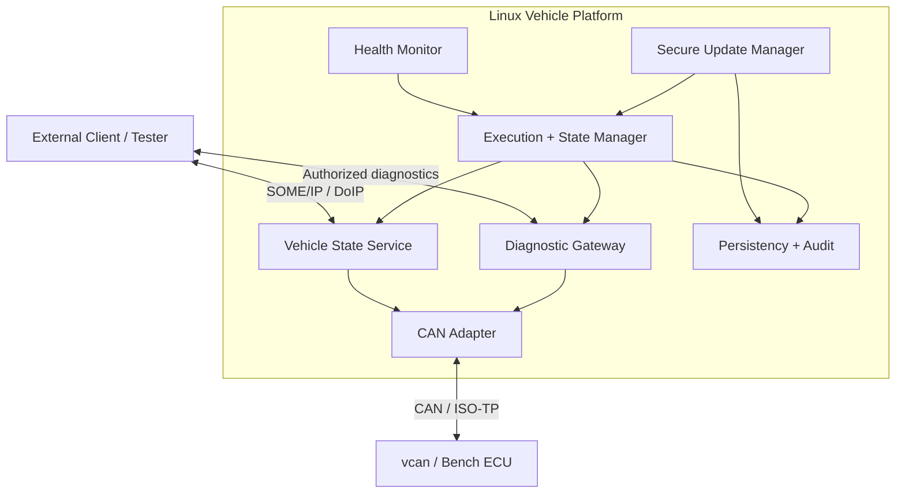

# P05 — Secure Adaptive Vehicle Service Gateway

Status: Planned

## 한 줄 설명

Classic CAN ECU와 Ethernet 애플리케이션 사이에서 차량 데이터를 서비스화하고, 진단·프로세스 수명주기·상태·고장 감시·정책·서명된 업데이트를 제공하는 Linux 기반 Adaptive AUTOSAR concept-aligned prototype입니다.

## 통합 범위

| Process | Responsibility |
| --- | --- |
| `can-adapter-service` | SocketCAN input, validation, signal decoding, bounded queue |
| `vehicle-state-service` | speed/RPM/gear/ignition SOME/IP interface |
| `diagnostic-gateway` | authorized DoIP/UDS request routing to CAN ISO-TP |
| `execution-manager` | Manifest-based lifecycle and dependencies |
| `state-manager` | Startup/Driving/Diagnostic/Update/Shutdown policy |
| `health-monitor` | heartbeat/deadline/crash detection |
| `update-manager` | verification, A/B activation, health check, rollback |
| `persistency-service` | config, version and transaction journal |
| `audit-service` | security and lifecycle event trail |

## 통합 아키텍처

## 최종 데모 시나리오

1. Manifest를 읽고 의존성 순서로 서비스가 시작된다.
2. 클라이언트가 Vehicle State Service를 발견하고 이벤트를 구독한다.
3. vcan/벤치 ECU 데이터가 SOME/IP 이벤트로 변환된다.
4. read-only 진단 요청이 DoIP → UDS → ISO-TP로 전달된다.
5. Vehicle State Service를 강제 종료하면 health/lifecycle 정책으로 복구된다.
6. 변조 업데이트는 설치 전에 거부된다.
7. 정상 서명 업데이트를 inactive slot에 설치하고 활성화한다.
8. 새 버전 health check를 의도적으로 실패시켜 이전 버전으로 rollback한다.
9. audit log와 측정 보고서에서 전체 과정을 확인한다.

## 필수 장애 시나리오

| Fault | Expected behavior | Required metric/evidence |
| --- | --- | --- |
| service crash | limited restart then defined state | detection/recovery time |
| wrong start order | dependency plan enforces order | lifecycle log |
| network loss | unavailable then rediscovery | downtime, duplicate events |
| heartbeat loss | degraded/recovery transition | deadline error bound |
| CAN flood | bounded queue and service survival | drops, CPU, RSS |
| malformed CAN/UDS | reject without state corruption | negative tests |
| log storm | rate limit or bounded buffer | dropped-log counter |
| tampered update | reject before staging | verification log |
| failed new version | automatic rollback | rollback time |
| power-loss simulation | journal recovery | crash-state matrix |

## 포트폴리오 산출물

- [ ] 재현 가능한 build/deploy/run 문서
- [ ] Context/Container/Component 구조
- [ ] AUTOSAR concept mapping과 명시적 비적합 범위
- [ ] versioned service interface
- [ ] Manifest와 상태/프로세스 정책
- [ ] 요구사항 및 traceability matrix
- [ ] 정상·오류·장애 주입 test specification
- [ ] threat model과 residual risks
- [ ] p50/p95/p99, CPU/RAM, discovery/recovery performance report
- [ ] 비식별화한 SOME/IP-SD/SOME/IP/DoIP/CAN 증거
- [ ] GCC/Clang, sanitizer, unit/integration CI
- [ ] 부팅 → 통신 → 장애 → 복구 → rollback 데모 영상

## 성공 기준

- 새 Ubuntu 환경에서 문서만으로 재현할 수 있다.
- 정상 경로보다 장애 주입과 복구 결과가 더 명확하게 증명되어 있다.
- 모든 핵심 주장은 requirement, code, test, result로 연결된다.
- 상용 AUTOSAR stack을 사용하지 않았다는 한계를 숨기지 않는다.
- 실차 안전과 제3자 권리를 침해하지 않는 공개 데이터만 포함한다.

