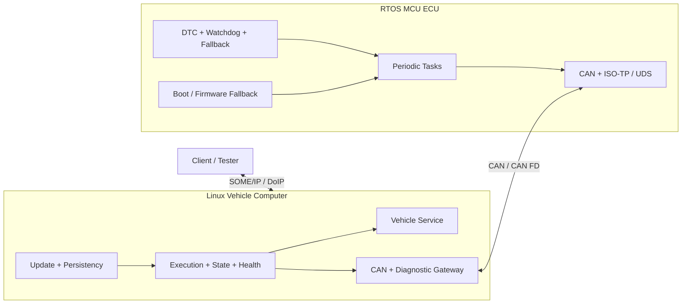

# P06 — Heterogeneous MCU–Linux Vehicle Platform

Status: Planned

RTOS MCU ECU와 Linux 차량 컴퓨터를 하나의 차량 기능으로 묶습니다. 두 node의 시간, 상태, 버전, 진단, 업데이트, 복구 계약을 같은 시험에서 확인합니다.

## Reused releases

| Component | Source release |
| --- | --- |
| MCU task·CAN·diagnostics node | P00-C |
| Linux process supervision | P01 |
| SOME/IP vehicle service | P02 |
| lifecycle·state·health manager | P03 |
| update assurance | P04 |
| initial data path | P05 |

G12의 개발 범위는 release된 구성요소의 계약과 failure propagation 통합입니다.

## Architecture

## End-to-end contracts

| Contract | Required decision |
| --- | --- |
| Data | ID, unit, range, owner, quality, sequence |
| Freshness | source timestamp, stale threshold, unavailable policy |
| Clock | domain, synchronization, offset, drift, uncertainty |
| Timing | functional deadline, per-hop budget, analytical and measured evidence |
| Queue | capacity, backpressure, drop/overwrite/block policy |
| State | startup, driving, diagnostic, update, degraded, fallback mapping |
| Diagnostics | allowed SID/session, timer/NRC translation, caller policy, audit |
| Version | service, gateway, MCU firmware compatibility and partial deployment |
| Recovery | fault detection, containment, action, deadline, evidence |
| Update | activation order, trust assumption, last-known-good recovery |

One-way latency는 clock uncertainty가 관리되는 구간에서만 보고합니다. 동기화가 없으면 RTT 또는 correlation-based bound를 사용합니다.

## Requirements

- all `REQ-RTOS`, `REQ-CAN`, `REQ-ECU-DIAG`, `REQ-DTC`, `REQ-GW-DIAG`
- all `REQ-COM`, `REQ-EXEC`, `REQ-STATE`, `REQ-HEALTH`, `REQ-PLAT`
- all `REQ-UCM`, `REQ-OBS`, `REQ-QUAL`, `REQ-PERF`
- all `REQ-ARCH`, `REQ-TIME`, `REQ-FALLBACK`, `REQ-SAFE`, `REQ-SEC`
- `REQ-TOOL-001`

통합 릴리스에는 실제로 사용한 update tier를 기록합니다. `REQ-BOOT-001`–`003`은 P04-T3를 선택하고 hardware trust root를 시험한 릴리스에만 적용합니다.

## Integration stages

1. host-native/vcan contract replay
2. RTOS simulator와 Linux host
3. physical MCU/CAN bench와 Linux host
4. clean two-node deployment

같은 contract test를 재사용하고 stage별 결과를 분리합니다.

## Fault campaign

| Fault | Expected propagation |
| --- | --- |
| MCU task overrun | local fallback → stale/quality → Linux service state |
| watchdog reset | defined output, reset reason, diagnostic availability transition |
| CAN bus-off | communication unavailable, bounded recovery, client event |
| CAN flood | bounded queues, drop evidence, unrelated service 생존 |
| malformed UDS | MCU reject, gateway audit, unchanged application state |
| Linux service crash | manager action과 client availability sequence |
| SOME/IP network loss | unavailable transition, rediscovery, resubscription |
| version mismatch | activation block 또는 documented degraded behavior |
| tampered update | pre-activation rejection |
| power interruption | last-known-good recovery within documented trust assumptions |
| simultaneous MCU reset and Linux crash | deterministic recovery ordering |
| clock uncertainty overflow | stale/latency claim downgrade와 audit |

## Architecture package

- system context, component, deployment, sequence, state diagrams
- measurable requirements와 interface specification
- task/process/thread model
- response-time, CPU, memory, storage, network budget
- startup/shutdown/update plan
- educational HARA, FMEA/FTA, TARA, assurance case
- requirement-to-result traceability
- disputed decision ADR 다섯 건 이상

## Compiler analysis

CAN decode, CRC, bounded queue, ISO-TP parser, state transition 함수를 분석 corpus에 넣습니다. Cortex-M과 AArch64 결과는 target별 budget 안에서 평가합니다. Compiler·flag·linker version을 고정하고 unsupported `-Oz` 조합은 사용하지 않습니다.

## Final demo

1. 두 node가 호환 version과 정해진 순서로 시작한다.
2. MCU data가 CAN을 거쳐 SOME/IP event로 전달된다.
3. DoIP read request가 UDS/ISO-TP endpoint에서 응답한다.
4. task overrun, bus-off, process crash, network loss를 차례로 주입한다.
5. 상태·로그·metric에서 detection, containment, recovery를 확인한다.
6. 변조 package를 거부하고 정상 update의 health failure를 rollback한다.
7. 요구사항, budget, test, 결과를 commit 단위로 추적한다.

## Completion

- 제3자 clean reproduction
- 10개 이상 자동 fault scenario
- 분석과 실측이 연결된 timing/resource budget
- 기준선에 올린 모든 요구사항의 완전한 traceability
- 외부 requirement change와 design defense
- 영어 README, versioned release, 5–10분 demo

Mixed-criticality라는 이름은 [M1 선택 Gate](../../ROADMAP.md#선택-심화-gate)를 통과한 결과에만 사용합니다.
