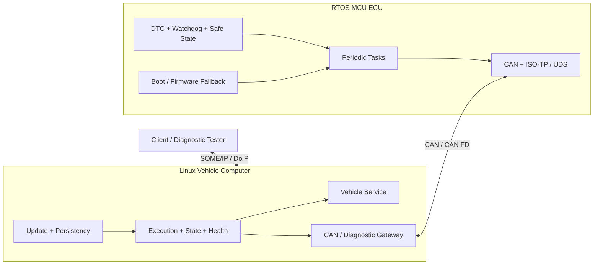

# P06 — Mixed-Criticality Vehicle Compute Platform

Status: Planned

## Problem

RTOS MCU ECU와 Linux vehicle computer를 하나의 차량 기능으로 통합하고, timing·state·diagnostic·update·failure contract가 두 node 사이에서도 유지되는지 증명합니다.

“Mixed-criticality”는 안전 인증을 주장하는 이름이 아닙니다. 서로 다른 timing/resource/failure 특성을 가진 MCU와 Linux 영역을 분리하고 통합 정책을 실험한다는 의미로 사용합니다.

## Nodes

### MCU ECU

- periodic RTOS tasks
- sensor/actuator simulation
- CAN/CAN FD and ISO-TP/UDS
- DTC and persistent state
- watchdog, bus-off recovery, safe state
- flash layout and firmware version/fallback

### Linux vehicle computer

- SOME/IP Vehicle State Service
- Execution/State Manager
- Health Monitor
- CAN–SOME/IP gateway
- DoIP–UDS gateway
- persistency and structured logging
- signed A/B update and rollback

## System architecture

## End-to-end contracts

| Contract | Required decision |
| --- | --- |
| Data freshness | MCU timestamp/sequence, gateway stale threshold, client unavailable policy |
| Timing | sample-to-service deadline and per-hop budget |
| Queueing | capacity, backpressure, drop/overwrite/block policy |
| State | Startup/Driving/Diagnostic/Update/Degraded/Safe mapping across nodes |
| Diagnostics | allowed SID/session, timeout/NRC translation, audit |
| Version | service, gateway, MCU firmware compatibility matrix |
| Recovery | task overrun, watchdog reset, bus-off, process crash, network loss |
| Update | Linux A/B and MCU known-good/fallback coordination |
| Observability | common correlation ID/timestamp and cross-node event trail |

## Related requirements

- all `REQ-RTOS`, `REQ-CAN`, `REQ-COM`, `REQ-EXEC`, `REQ-STATE`
- all `REQ-DIAG`, `REQ-HEALTH`, `REQ-UCM`, `REQ-OBS`, `REQ-PERF`
- `REQ-ARCH-001`–`REQ-ARCH-005`
- `REQ-TOOL-001`

## Integration stages

1. native/vcan simulation of both contracts
2. MCU simulator or RTOS target + Linux host
3. physical MCU board + Raspberry Pi/laptop
4. optional parked vehicle receive-only input

각 단계는 같은 contract tests를 재사용합니다.

## Required fault scenarios

| Fault | Propagation and expected state |
| --- | --- |
| MCU task overrun | MCU degraded → data stale/quality flag → Linux service state |
| watchdog reset | safe output, reset reason, diagnostic availability transition |
| CAN bus-off | gateway unavailable, bounded recovery, client event |
| CAN flood | bounded MCU/Linux queues and drop evidence |
| malformed UDS | MCU rejects, gateway audits, no state corruption |
| Linux service crash | manager restarts; client unavailable/recovery sequence |
| SOME/IP network loss | availability transition and rediscovery |
| version mismatch | incompatible deployment blocked or degraded by explicit policy |
| tampered update | rejected before staging/transfer |
| power loss during update | last-known-good boot on both nodes |
| new Linux version unhealthy | A/B rollback |
| new MCU image unhealthy | fallback/recovery mode |

## Architecture deliverables

- stakeholder/system/software requirements
- context/component/deployment diagrams
- interface and compatibility specification
- task/process/thread model
- timing/CPU/memory/network budgets with margin
- startup/shutdown/diagnostic/update sequences
- state machines and failure mode table
- threat model and residual risks
- requirement-to-result traceability
- ADRs for at least five disputed design choices

## Compiler analysis integration

다음 critical functions를 [compiler analysis track](../../compiler-analysis/README.md)에 포함합니다.

- CAN/DBC decode
- CRC/checksum
- ring buffer
- ISO-TP/UDS parser
- state transition dispatch

Cortex-M과 AArch64에서 GCC/Clang, `-O2/-Oz`, LTO, code size, runtime/cycle, stack과 UB를 비교하고 budget decision에 반영합니다.

## Final demo

1. 두 node가 정의된 순서와 version contract로 시작한다.
2. MCU periodic data가 CAN을 거쳐 SOME/IP event로 전달된다.
3. DoIP read request가 UDS/ISO-TP를 거쳐 응답한다.
4. MCU overrun/bus-off와 Linux crash/network loss를 차례로 주입한다.
5. 상태·로그·metric에서 detection, containment, recovery를 확인한다.
6. 변조 update를 거부하고 정상 update 뒤 health failure를 주입한다.
7. 양 node가 last-known-good version으로 복구된다.

## Completion gate

- [ ] clean environment에서 제3자가 문서만으로 demo를 재현한다.
- [ ] 10개 이상의 fault scenario가 자동 검증된다.
- [ ] timing/memory/CPU/network budget이 raw measurement와 연결된다.
- [ ] 모든 critical requirement가 architecture, code, test, result까지 추적된다.
- [ ] external design review와 변경 요구 대응 기록이 있다.
- [ ] 영어 README와 5–10분 기술 데모가 문제·설계·증거·한계를 보여준다.
- [ ] AUTOSAR 적합성과 production safety를 주장하지 않는다.

